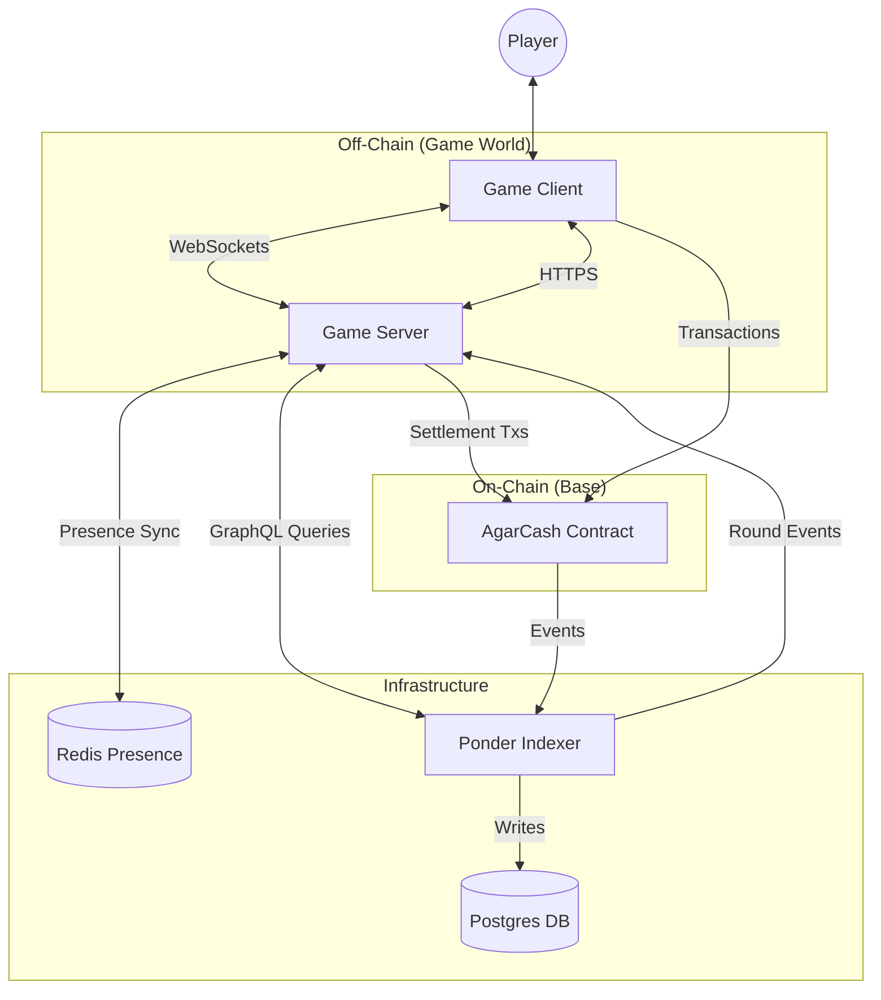
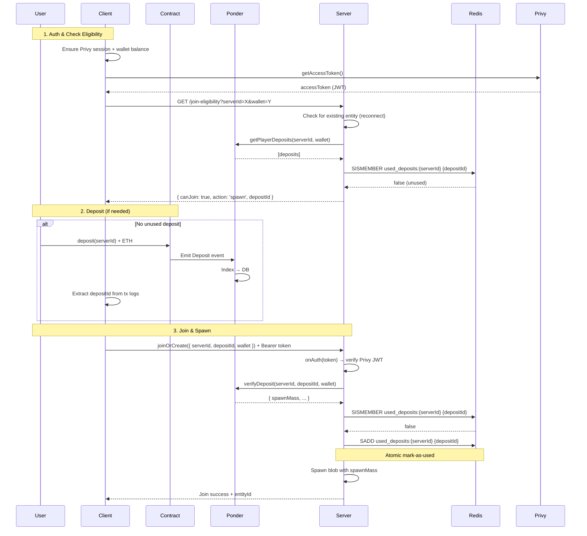
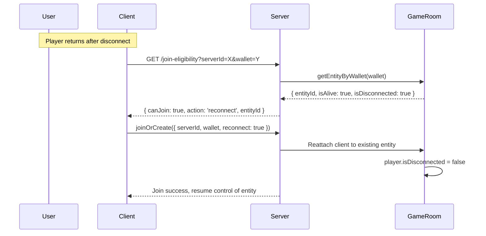
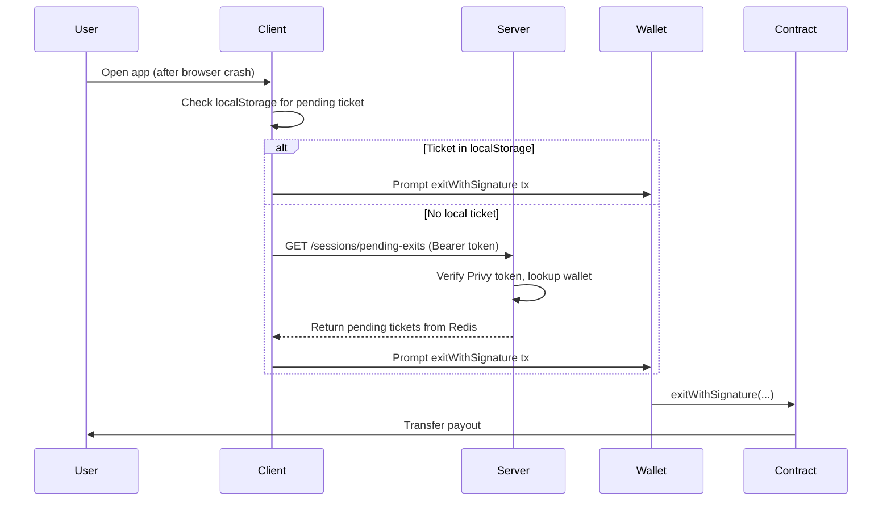
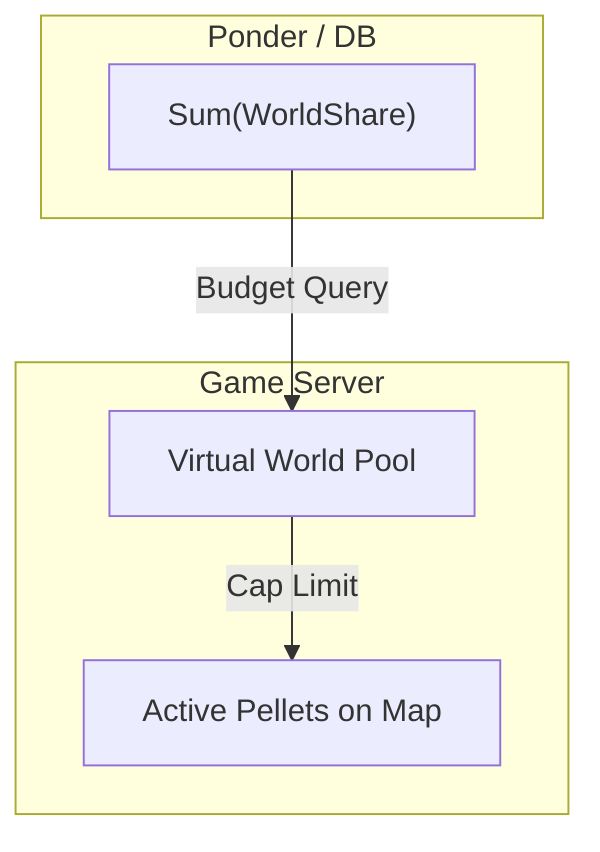
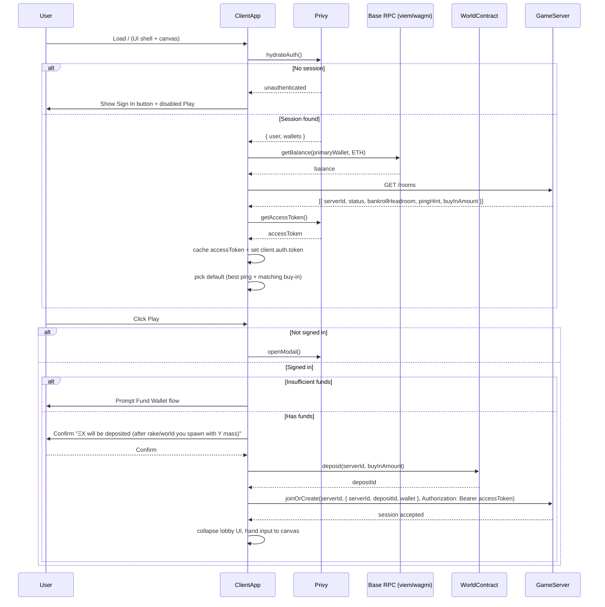
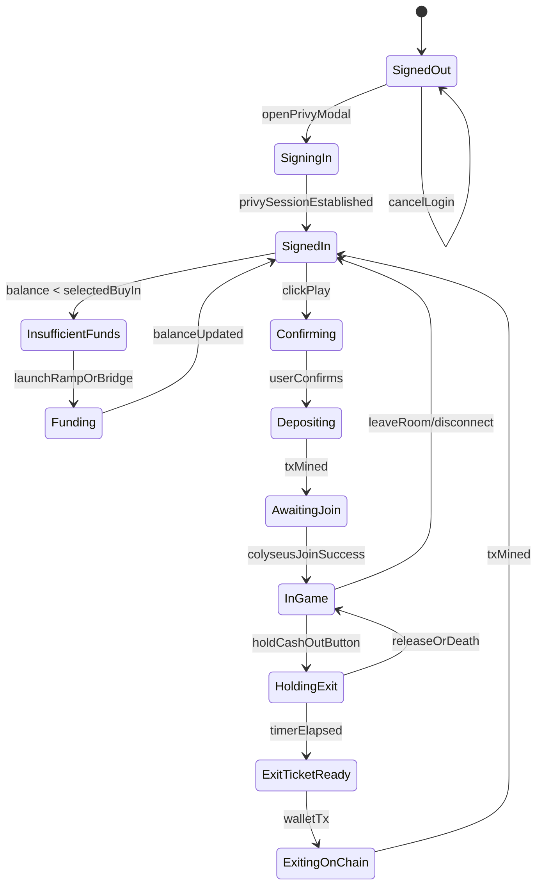
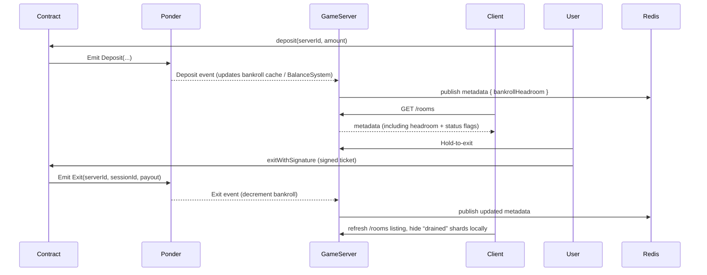

# AgarCash System Architecture

## 1. High-Level Overview

The system consists of four main components:
1.  **Client**: The player's interface (React/Canvas/Privy) plus lobby UX.
2.  **Game Server**: Authoritative game logic (Colyseus/Express/Node.js/Typescript). Also exposes all lobby/discovery REST endpoints directly.
3.  **Smart Contract**: Economic settlement and custody (Solidity/Base).
4.  **Indexer (Ponder)**: Real-time event indexing, solvency tracking, and round lifecycle streaming.



---

## 2. Component Interfaces

### 2.1 Smart Contract (`World.sol`)
**Role:** Custody, upfront fee splitting, continuous settlement, and authoritative registry for every Game Server.

*   **Server Registry**
*   `servers[bytes32 serverId]`: stores `{ controller, buyInAmount, configHash, massPerEth, rakeShareBps, worldShareBps, exitHoldMs }` where `buyInAmount` is denominated in wei (ETH).
*   `addServer(serverId, controller, buyInAmount, config)`: admin-only. Adds/updates an entry so new servers can come online without redeploying contracts.
    *   `removeServer(serverId)`: admin-only. Immediately locks deposits/exits for that server.

*   **Economy Parameters (per `serverId`):**
*   `massPerEth`: deterministic conversion between spawned mass and one ETH-equivalent unit for that shard (we keep the scalar for gameplay tuning).
    *   `rakeShareBps` / `worldShareBps`: basis-point splits used to route value to the developer and the shared world pool. Whatever remains becomes the playable spawn budget (escrowed in `serverBankroll[serverId]`).
    *   `exitHoldMs`: milliseconds a player must hold the **exit key (Q)** to successfully cash out; tunable per server to balance risk/reward. On the wire this is modeled as a boolean field in the input payload (historically named `spacebar`).

*   **Write Interfaces (all scoped by `serverId`):**
*   `deposit(bytes32 serverId) payable`: User funds a session with ETH. The contract splits `msg.value` into `{ spawnAmount, worldAmount, rakeAmount }`, transfers the rake share immediately, **retains the world share inside `World.sol` (world pool)**, credits `serverBankroll[serverId] += (spawnAmount + worldAmount)` (since pellet-derived mass is redeemable), and emits `Deposit(player, spawnAmount, worldAmount, rakeAmount, serverId, depositId)`.
    *   `exitWithSignature(bytes32 serverId, bytes32 sessionId, uint256 payout, bytes signature)`: Player-triggered withdraw. Verifies that the payload was signed by the registered `controller`, checks `payout <= serverBankroll[serverId]`, checks `exitedSessions[serverId][sessionId] == false` (replay protection), marks session as exited, debits the bankroll, and transfers `payout` to the player. Gas is paid by the player.
    *   (Optional) `cancelDeposit(serverId, depositId)`: Used if a player never joins after depositing; refunds `spawnAmount` minus fees.

*   **Storage (replay protection):**
    *   `exitedSessions[serverId][sessionId]`: `bool` — prevents the same exit ticket from being claimed twice.

*   **Events (Listened to by Ponder):**
*   `AddedServer(serverId, controller, buyInAmount, configHash, massPerEth, rakeShareBps, worldShareBps, exitHoldMs)`
    *   `RemovedServer(serverId)`
    *   `Deposit(address player, uint256 spawnAmount, uint256 worldAmount, uint256 rakeAmount, bytes32 serverId, bytes32 depositId)`
    *   `Exit(address player, bytes32 serverId, bytes32 sessionId, uint256 payout)`

### 2.2 Ponder Indexer
**Role:** Validates per-round deposits, tracks solvency, exposes round lifecycle for gating joins.

*   **Ingestion:** Listens to `AddedServer`, `RemovedServer`, `Deposit`, and `Exit` events emitted by the single `World.sol`, always keyed by `serverId`.
*   **Subscriptions:** Streams deposit confirmations and controller exit approvals to each Game Server via WebSocket or Redis pub/sub so off-chain state can mirror on-chain solvency.
*   **GraphQL API (Consumed by Server/Client):**
    *   `deposit(id: txHash)` / `depositByAddress(serverId, address)`: Verify that a wallet funded the server, the tx was confirmed, and it has not been fully exited.
    *   `sessionBalance(serverId, address)`: Returns the net spawn budget remaining for an account (deposits - exits).
    *   `exitHistory(serverId, address)`: Mirrors past exits so the client can show lifetime profitability.
    *   `playerStats(address)`: Historical wins/losses (optional but handy for UX).
    *   `worldPoolBalance()`: Computed aggregate of `worldShare` from all deposits vs. payouts.
*   **Data Model**
*   `servers` table: `{ serverId (PK), controller, buyInAmount, configHash, massPerEth, rakeShareBps, worldShareBps, exitHoldMs, lastHeartbeatBlock }`.
    *   `deposits` table: `{ depositId (PK), serverId, player, amount, spawnMass, rakeAmount, worldAmount, exitedAmount, blockNumber, timestamp }`.
    *   `sessions` table: `{ serverId, sessionId, player, depositId, spawnedMass, exitRequestedAt, exitCompletedAt, finalPayout }`.
    *   `exits` table: `{ exitTxHash (PK), serverId, sessionId, player, payout, blockNumber }`.
    *   Aggregates cached in Redis: `{ worldPoolBalance, outstandingDeposits }` to answer solvency queries quickly.

### 2.3 Game Server (`GameRoom.ts`)
**Role:** Physics, State Sync, Pellet Spawning, Session Verification.

*   **WebSocket Messages:**
    *   `input`: `{ x, y, exitHold, split }` — movement vectors plus two booleans:
        *   `exitHold`: whether the **exit key (Q)** is currently held (sustained `exitHold: true` triggers the exit hold countdown).
        *   `split`: whether the **split key (Spacebar)** was just pressed (single-tick edge trigger to initiate a split).
*   **Internal Logic:**
    *   `static async onAuth(token, options, context)`: Uses the Privy verification key to validate the bearer token provided by the client (`context.token`) before the room spins up; rejects immediately on invalid/expired tokens.
    *   `onJoin(client, options, auth)`: Called only after `onAuth` succeeds; validates `{ serverId, depositId, wallet }` via Ponder to ensure the user deposited for this shard and that the deposit hasn’t been fully exited. Issues a `sessionId`, records spawn mass, and binds `auth` (verified Privy claims) to the physics entity.
    *   `sessionManager`: Tracks per-client spawn mass, deficit (because of rake/world), and accumulated gains/losses. Exposes APIs to start/stop the **Hold-to-Exit Timer**.
    *   `exitController`: Triggered when sustained `spacebar: true` is detected in the input stream:
        1.  Marks the blob as "exiting" and applies exit penalties: **speed reduced** by `EXIT_SPEED_PENALTY`, **radius shrinks** toward `EXIT_MIN_RADIUS_FACTOR` over the hold duration (see §4.10).
        2.  Starts a countdown (`exitHoldMs`, configurable per server). If spacebar is released or the blob dies, cancel the exit and resume gameplay.
        3.  On success: snapshots final mass, converts to payout using `massPerEth`, clamps by `availableHeadroom`, despawns blob, closes session.
        4.  Signs `ExitTicket { serverId, sessionId, player, payout, nonce, expiry }` and persists it in Redis (`exit_ticket:{serverId}:{sessionId}`, TTL = expiry).
        5.  Reserves payout from bankroll headroom (`availableHeadroom -= payout`) so concurrent exits don't overdraw.
        6.  Sends ticket to client in the session-close message; on `Exit` event confirmation from indexer, deletes ticket and finalizes bankroll deduction.
    *   `update()`: Runs physics loop (`TICK_RATE` Hz), processes movement, collision detection, eating logic, and exit hold progression. See §4 for full game rules.
*   `presenceHeartbeat()`: Publishes `{ serverId, status, players, exitHoldMs, bankrollHeadroom }` into Redis Presence so `/rooms` responses and ops dashboards stay synchronized.

### 2.4 Client (`packages/client`)
**Role:** The full game client (canvas + UI shell). Orchestrates identity, wallet balance checks, direct server discovery (via `/rooms`), and the "Play" CTA before handing control to the Colyseus room.

The concrete implementation lives under `packages/client`:

- `src/main.tsx` – bootstraps the React app and wraps it in `PrivyProvider`, `WagmiProvider`, `GameClientProvider`, and `UIProvider`.
- `src/App.tsx` – top-level UI shell that composes the world canvas (`World`) and overlay UI (`Overlay`).

#### Frontend Implementation Stack

| Layer | Technology | Notes |
|-------|------------|-------|
| Rendering / Game View | **Canvas API + TypeScript** | The gameplay surface is a plain `<canvas>` managed via low-level Canvas 2D APIs for predictable performance. TypeScript typings wrap the canvas helpers (stroke/fill, off-screen buffers, etc.) so physics projections line up with the Colyseus state schema. |
| UI Shell | **React 18** | All overlay UX (lobby, HUD, modals) lives in React components. React Context provides a shared store between the canvas renderer and UI widgets for things like exit-status, pellet counts, or latency warnings. |
| Design System | **Custom CSS + simple components** | The current implementation uses a lightweight, custom-styled overlay rather than a full shadcn-based design system. This can be swapped for shadcn/ui in the future without changing the canvas API. |
| Realtime Networking | **`colyseus.js` client** | React hooks call `client.joinOrCreate("game")`, hydrate the read-only Schema proxies, and subscribe to state change callbacks. All outbound input uses the Colyseus reliable message channel (`room.send("input", payload)`). |
| Auth / Wallet | **Privy SDK (`@privy-io/react-auth`) + wagmi/viem** | The overlay hosts Privy’s auth widget. After login, we call `getAccessToken()` and set `client.auth.token`. Privy’s hooks provide `linkedWallets`, and we route `depositId` + wallet into the Colyseus join payload. |

Key files (client):
1. `packages/client/src/providers/GameClientProvider.tsx` – bootstraps and caches the Colyseus client, exposes join/leave helpers and session phase.
2. `packages/client/src/world/World.tsx` – React host for the `<canvas>` element; wires the renderer and input layer to the game client context.
3. `packages/client/src/world/renderer.ts` – pure TypeScript canvas renderer, reading a view-model of the game state and drawing blobs/pellets every animation frame.
4. `packages/client/src/world/input.ts` – attaches browser input listeners to the canvas and forwards normalized input events to the game server.
5. `packages/client/src/components/overlay/PlayButton.tsx` – orchestrates auth, funding, deposit, join eligibility, and finally calls `joinGame` on the `GameClientProvider`.

*   **Auth & Identity**
    *   On page load, call Privy to hydrate `authState`. Maintain `session`, `user`, `linkedWallets`.
    *   Immediately fetch a short-lived Privy access token via `getAccessToken()` (React hook) and refresh it whenever `authState` changes so outbound API calls and Colyseus joins can be signed.
*   Navbar shows `Sign In` when no Privy session; otherwise display `username`, `primaryWallet`, `ETH balance`.
    *   Login/sign-up modal is the same surface triggered by navbar and by the `Play` button guard.
*   **Balances & Funding**
    *   Uses `viem/wagmi` `getBalance` against Base RPC for the selected wallet.
*   Maintains `selectedBuyIn` (ETH-denominated). If `walletBalance < buyIn`, surface `Fund Wallet` panel (ramps or bridging).
*   **Server Discovery UI**
    *   On mount call any game server’s `GET /rooms` once, cache the full set of active rooms (metadata includes status, ping hint, region, `serverId`, live round info, `currentRoundId`).
*   Provide tabs for buy-in presets (e.g., `0.01 ETH`, `0.02 ETH`, custom) that **filter locally** within the cached dataset, along with a searchable dropdown for all regions/instances.
    *   Best-ping suggestion: run lightweight RTT probe against each server’s `/healthz` endpoint and pre-select the lowest latency option.
*   **CTA & Consent Flow**
    *   Giant `Play` button remains visible regardless of auth state.
*   Guards (in order): requires Privy session → successful Privy access token refresh → sufficient funds → user confirmation that `ΞX` will be deposited (highlighting rake/world shares so they understand the starting deficit) → triggers `deposit(serverId, amount)` on `World.sol`.
    *   After the deposit transaction is accepted, the client issues the Colyseus `joinOrCreate` request with `{ serverId, depositId, wallet }`, includes the Privy access token as the Colyseus auth header, and collapses the pre-game UI once the server verifies the deposit with the indexer.
    *   Because there's no round gating, availability depends on bankroll headroom; servers that fall below a threshold are marked “Drained” and the CTA nudges users toward healthier shards.
*   **Hold-to-Exit UX**
    *   Exit is triggered by holding the **Q key**. When the server detects sustained `exitHold: true` in the input stream, it starts the exit countdown (`exitHoldMs`, configurable per server). The UI renders a progress ring over the blob.
    *   **Blob behavior during hold:** Speed is reduced by `EXIT_SPEED_PENALTY` and radius shrinks toward `EXIT_MIN_RADIUS_FACTOR` over the hold duration. The shrinking makes the blob vulnerable to being eaten by smaller opponents (see §4.10).
    *   If spacebar is released or the blob dies, the exit is cancelled and normal gameplay resumes.
    *   Once the hold completes, the server **despawns the blob, closes the session**, and issues an `ExitTicket`. The ticket is persisted server-side (Redis) and sent to the client in the session-close payload. The UI stores the ticket in `localStorage` as backup and immediately prompts the wallet for `exitWithSignature()`.
    *   If the browser closes before the tx lands, the client checks `localStorage` on next load and/or calls `GET /sessions/pending-exits` (Privy-auth-gated) to retrieve any unclaimed tickets.
    *   Tickets have a generous expiry (e.g., 24h). If unclaimed by expiry, the reservation is released back to bankroll and the payout is forfeited.
*   **Game Canvas Integration**
    *   The UI shell communicates with the canvas via a shared context/store (`GameClientProvider`). The provider owns the Colyseus `Client`/`Room`, exposes helpers to join/leave, and (in its final form) will expose a read-only "latest game state" snapshot plus a `sendInput(payload)` function for the canvas layer.
    *   The `World` React component is intentionally thin: it renders a single `<canvas>` and, on mount, bootstraps two pure TypeScript modules:
        *   `bootstrapRenderer(canvas, getViewModel)` from `world/renderer.ts` – a render loop that reads a **view model** of the game (`WorldViewModel`) every animation frame and draws pellets, blobs, and HUD using the Canvas 2D API.
        *   `attachInputListeners(canvas, controller)` from `world/input.ts` – attaches pointer/keyboard listeners and forwards normalized events into a controller interface.
    *   A small adapter layer in `world/adapters.ts` connects the game client to the canvas APIs:
        *   It pulls the latest Colyseus `GameState` snapshot and derives a camera-centric `WorldViewModel` (local player position, visible pellets/players, exit-hold status, etc.) consumed by the renderer.
        *   It implements a `WorldInputController` interface with methods like `onPointerMove({ x, y })`, `onSpaceDown()`, and `onSpaceUp()`. These update transient client-side input state and send `{ x, y, spacebar }` messages via `room.send("input", payload)` at a throttled rate.
    *   This separation keeps the canvas layer framework-agnostic (no React imports in `renderer.ts` or `input.ts`) and makes it easy to test or swap rendering tech (e.g., to WebGL) without touching the lobby/overlay React components.
    *   When the player exits/disconnects, the lobby shell re-opens and re-fetches balances, session history, and leaderboard stats to keep the experience fresh, while the canvas is torn down and its event listeners/animation loop are fully cleaned up.

#### 2.4.1 `World` Component Frame Lifecycle

**High-level role**

- `World` is a thin React wrapper around a `<canvas>` element.
- It does **not** contain game logic; instead, it:
  - Wires the canvas to the **game client context** (`GameClientProvider`).
  - Boots a **renderer loop** (`bootstrapRenderer`) that draws each frame based on authoritative game state.
  - Boots an **input layer** (`attachInputListeners`) that translates browser events into `ClientInput` messages sent to the game server.
- The **physical exit key** is **Q**. On the wire this is represented as the `spacebar` boolean in `{ x, y, spacebar }` (i.e. “exit button held”), but no actual keyboard spacebar is used during gameplay.

**On mount (React effect)**

1. **Resolve game client context**
   - `World` calls a hook (e.g. `useGameClientContext` / `useGameSession`) to access:
     - `room`: the current Colyseus room (if joined).
     - `getStateSnapshot(): GameState | null`: returns the latest authoritative schema snapshot (or `null` if not in-game).
     - `sendInput(input: ClientInput): void`: wraps `room.send("input", input)` and no-ops if `room` is `null`.

2. **Create world adapter**
   - `World` constructs an adapter from `world/adapters.ts`, for example:
     - `const adapter = createWorldAdapter({ getStateSnapshot, sendInput })`.
   - The adapter exposes:
     - `getViewModel(): WorldViewModel | null` – converts the authoritative `GameState` into a camera‑centric view model for rendering.
     - `controller: WorldInputController` – small object with methods:
       - `onPointerMove({ x, y })`
       - `onExitKeyDown()`  // user pressed Q
       - `onExitKeyUp()`    // user released Q
     - Internally, the controller:
       - Tracks the latest cursor target position.
       - Tracks whether the **exit key (Q)** is currently held.
       - At a throttled rate, calls `sendInput({ x, y, spacebar })`, where `spacebar` encodes “Q is currently held”.

3. **Bootstrap renderer**
   - `World` grabs the `canvas` ref (`useRef<HTMLCanvasElement>()`) once it’s in the DOM.
   - It calls `const cleanupRenderer = bootstrapRenderer(canvas, adapter.getViewModel)`.
   - Inside `bootstrapRenderer(canvas, getViewModel)`:
     - Sets `canvas.width` / `canvas.height` from the window size and attaches a `resize` listener.
     - Defines a `render()` function and kicks off the loop with `requestAnimationFrame(render)`.

4. **Attach input listeners**
   - `World` wires input via:
     - `const cleanupInput = attachInputListeners(canvas, adapter.controller)`.
   - Inside `attachInputListeners(canvas, controller)`:
     - Registers `pointermove` / `mousemove` to track cursor position relative to the canvas:
       - Computes normalized coordinates:
         - \( x = (clientX - canvasRect.left) / canvasRect.width \)
         - \( y = (clientY - canvasRect.top) / canvasRect.height \)
       - Calls `controller.onPointerMove({ x, y })`.
     - Registers `keydown` / `keyup` for the **exit key (Q)**:
       - On `keydown` where `event.code === "KeyQ"` → `controller.onExitKeyDown()`.
       - On `keyup` where `event.code === "KeyQ"` → `controller.onExitKeyUp()`.

5. **Cleanup on unmount**
   - When `World` unmounts:
     - `cleanupInput()` removes all event listeners.
     - `cleanupRenderer()` cancels `requestAnimationFrame` and the `resize` listener.

**Per-frame behavior inside `bootstrapRenderer`**

All per‑frame work happens inside the renderer loop; React is not involved.

1. **Read view model**
   - Each `render()` call does `const view = getViewModel()`.
   - If `view === null`:
     - Clears the canvas.
     - Draws a neutral background (e.g. dim fill or simple grid).
     - Schedules the next frame and returns.
   - Otherwise, `view` includes:
     - `camera`: world‑space camera center/zoom (typically centered on local player blobs).
     - `playerBlobs`: local blobs with `position`, `radius`, `mass`, `status` (normal vs exiting).
     - `otherBlobs`: visible opponent blobs.
     - `pellets`: visible pellets.
     - `worldBounds`: map bounds.
     - `hud`: HUD data such as current mass, payout estimate, `exitHoldProgress` (0→1), ping, etc.

2. **Prepare canvas**
   - Gets the 2D context and clears the viewport.
   - Computes world→screen transform from `view.camera`:
     - Translation so the camera center maps to the canvas center.
     - Scale factor for zoom (smaller blobs zoomed in more, larger blobs zoomed out).

3. **Draw background and bounds**
   - Calls something like `drawBackground(ctx, view.worldBounds, cameraTransform)`:
     - Fills background color/gradient.
     - Draws world border and optional grid lines.

4. **Draw pellets**
   - Calls `drawPellets(ctx, view.pellets, cameraTransform)`:
     - For each pellet, transforms its world position to canvas coordinates.
     - Draws a small filled circle for each pellet.

5. **Draw blobs**
   - Calls `drawBlobs(ctx, view.playerBlobs, view.otherBlobs, cameraTransform)`:
     - Draws `otherBlobs` first, then `playerBlobs` on top.
     - For each blob:
       - Transforms center + radius to screen space and draws a circle with fill + outline.
     - For **exiting** blobs (those currently holding Q / `spacebar: true` on the server):
       - Uses a visually shrunk radius based on `exitHoldProgress`.
       - Applies a special outline or pulsing effect to signal vulnerability.

6. **Draw HUD / overlays**
   - Calls `drawHUD(ctx, view.hud)`:
     - Renders screen-space text (e.g. top-left) for:
       - Current mass.
       - Payout estimate if exit completes now.
       - Room/server name, ping.
     - If `exitHoldProgress > 0`:
       - Draws a **circular progress ring** around the local player’s primary blob or at a fixed HUD position.
       - The arc angle is proportional to `exitHoldProgress` (0 → 1 over `exitHoldMs`).

7. **Schedule next frame**
   - At the end of `render()`:
     - Calls `requestAnimationFrame(render)` to keep the loop going.

**Per-input behavior via `attachInputListeners` + `WorldInputController`**

1. **Pointer move**
   - Browser emits `pointermove`/`mousemove`.
   - `attachInputListeners`:
     - Normalizes coordinates into canvas space: `(nx, ny)`.
     - Calls `controller.onPointerMove({ x: nx, y: ny })`.
   - The controller:
     - Updates its local `targetX`, `targetY`.
     - At a throttle interval (e.g. max 60 Hz), sends:
       - `sendInput({ x: worldX, y: worldY, spacebar: isExitKeyHeld })`
       - where `isExitKeyHeld` reflects whether **Q** is held.

2. **Exit key (Q) hold / release**
   - On `keydown` `"KeyQ"`:
     - `attachInputListeners` calls `controller.onExitKeyDown()`.
     - The controller sets `isExitKeyHeld = true` and immediately sends a `ClientInput` with current target position and `spacebar: true`.
   - On `keyup` `"KeyQ"`:
     - `attachInputListeners` calls `controller.onExitKeyUp()`.
     - The controller sets `isExitKeyHeld = false` and sends another `ClientInput` with `spacebar: false` to cancel the hold on the server.

3. **Focus / visibility**
   - On `window.blur` or `visibilitychange`:
     - The input layer may treat this as an implicit `onExitKeyUp()` and stop movement/exit updates to avoid “stuck” exits when the tab loses focus.
   - When `World` unmounts:
     - All listeners are removed and the controller state is discarded; a new `World` mount + join will recreate fresh wiring.

This lifecycle ensures that each visual frame is driven by the **latest authoritative game state** (read-only), while input events flow in the opposite direction through a narrow `ClientInput` API to the game server.

### 2.5 Room Discovery & Lobby Feed
**Role:** Provide the homepage with real-time knowledge of every Colyseus room across all game server instances.

*   **Architecture**
    *   No separate Directory service is needed. The Game Server exposes room discovery endpoints directly.
    *   `RedisDriver` from `@colyseus/redis-driver` stores room metadata in Redis, enabling `matchMaker.query()` to return rooms from ALL processes/machines.
    *   `RedisPresence` enables cross-process communication for pub/sub and shared state.
    *   Clients can call any game server's `/rooms` endpoint and receive the complete room listing.

*   **Game Server Endpoints**
    *   `GET /rooms`: returns all active rooms via `matchMaker.query()`. Each room includes `{ roomId, name, clients, maxClients, locked, metadata, createdAt }`.
    *   `GET /ping`: lightweight JSON response for browser RTT measurement.
    *   `GET /healthz`: health check endpoint.

*   **Room Metadata**
    *   Each `GameRoom` calls `this.setMetadata()` in `onCreate()` with: `{ serverId, buyInAmount, massPerEth, region, worldContract }`.
    *   This metadata is automatically included in `matchMaker.query()` results and exposed via `/rooms`.

*   **Client Flow**
    1.  Client calls `GET /rooms` on any game server instance.
    2.  Response includes all rooms across all machines (thanks to RedisDriver).
    3.  Client filters by `metadata.buyInAmount`, `metadata.region`, etc.
    4.  Client measures RTT by calling `GET /ping` on the target server.
    5.  Client connects via WebSocket to the selected room.

*   **Horizontal Scaling**
    *   Bring up additional game server processes/machines, each configured with the same Redis URL.
    *   RedisDriver automatically makes all rooms discoverable from any instance.
    *   Load balancer can distribute client connections across instances.

### 2.6 Auth & Session Security
**Role:** Make sure only Privy-authenticated wallets that have deposited into the selected server can ever reach gameplay, and that exit tickets cannot be forged or replayed.

*   **Client Responsibilities**
    *   After Privy login, call `getAccessToken()` and inject the token both into backend REST calls and the Colyseus JS client via `client.auth.token = accessToken`.
    *   Include `{ serverId, depositId, wallet }` inside the `spawnPayload`, while the Privy token rides in the `Authorization` header automatically handled by Colyseus once `client.auth.token` is set.
    *   When an exit ticket arrives, the client prompts the user to call `exitWithSignature(serverId, sessionId, payout, signature)` directly from their wallet so gas is self-sponsored.
*   **Server Responsibilities**
    *   `GameRoom.static onAuth(token, options, context)`: Verifies the Privy JWT using the configured verification key. Rejects immediately (before room instantiation) for invalid/expired tokens or mismatched app IDs.
    *   `GameRoom.onJoin(client, options, auth)`: Receives `auth` (Privy claims) and cross-checks deposit data with the Indexer before letting the player spawn. Marks `depositId` as “active session” only after token + deposit pass.
    *   `exitController`: Produces exit tickets signed with the server’s controller key; includes `sessionId`, `payout`, `nonce`, and `expiry` to prevent replay.
*   **Indexer & Contract Coupling**
    *   Deposits emit `{ serverId, depositId }`, so the indexer exposes `depositByAddress(serverId, wallet)` plus the active session footprint to the Game Server. Exits are confirmed by watching `Exit` events, allowing the server/client to show final balances.
*   **Failure Handling**
    *   Expired Privy tokens bounce at `onAuth` and bubble a `ServerError` back to the browser so the overlay can re-run `getAccessToken()` and retry.
    *   Deposit mismatches throw from `onJoin`, resulting in a client-facing error that re-opens the overlay instead of putting the user into the world.

### 2.7 Exit Ticket Persistence
**Role:** Ensure players can claim their exit payout even if the browser closes before the tx lands.

*   **Redis Ticket Store**
    *   Key: `exit_ticket:{serverId}:{sessionId}` → `{ ticket, player, payout, reservedAt }`.
    *   TTL matches ticket `expiry` (e.g., 24h). Auto-deletes on expiry.
    *   On `Exit` event confirmation from indexer, ticket is deleted and bankroll reservation is finalized.
    *   If TTL fires before claim, reservation is released back to `availableHeadroom`.

*   **Bankroll Reservation**
    *   `availableHeadroom = serverBankroll − sum(activeReservations)`.
    *   Prevents concurrent exits from overdrawing; new exits are clamped by `availableHeadroom`, not raw bankroll.

*   **REST Endpoint**
    *   `GET /sessions/pending-exits`: Returns all unclaimed tickets for the authenticated wallet. **Requires Privy access token**; server verifies the caller owns the wallet before returning tickets.
    *   Response: `[{ serverId, sessionId, payout, expiry, signature, ... }]`.

*   **Client Recovery Flow**
    *   On page load, check `localStorage` for cached tickets.
    *   Call `GET /sessions/pending-exits` to fetch any server-persisted tickets.
    *   If valid ticket exists, prompt wallet to call `exitWithSignature()`.

*   **Contract Replay Protection**
    *   `exitedSessions[serverId][sessionId]` mapping prevents the same ticket from being claimed twice.

### 2.8 Deposit Tracking & Join Eligibility
**Role:** Ensure each deposit can only spawn one blob, and support reconnection if a player's entity is still alive.

#### Deposit States

A deposit has exactly two states:
- **`unused`**: Exists on-chain (indexed), never used to spawn a blob
- **`used`**: Was used to spawn a blob (permanent, one-time flag)

There is no concept of "active session" vs "ended session" — once a deposit is used, it's used forever. Whether the resulting entity is alive, dead, or exited is a separate concern.

#### Server Storage (Redis)

```
# Redis SET - contains all depositIds that have been used
used_deposits:{serverId} = { depositId1, depositId2, ... }

# Atomic operations:
SISMEMBER used_deposits:{serverId} {depositId}  → boolean
SADD used_deposits:{serverId} {depositId}       → marks as used (atomic)
```

*   Redis persistence (AOF/RDB) ensures used deposits survive server restarts.
*   `SADD` is atomic, preventing race conditions from multiple browser tabs.

#### Entity-Wallet Mapping

To support reconnection, the game server tracks which wallet owns which living entity:

```typescript
// In-memory (GameRoom state)
state.players: Map<sessionId, Player>
// Player contains: wallet, blobs[], isAlive

// Derived lookup:
getEntityByWallet(wallet): Player | null  // Find living player by wallet
```

#### Join Eligibility Endpoint

`GET /join-eligibility?serverId=X&wallet=Y`

Returns one of:
```typescript
| { canJoin: true, action: 'reconnect', entityId: string }  // Entity alive, reconnect
| { canJoin: true, action: 'spawn', depositId: string }     // Unused deposit found
| { canJoin: false, reason: 'deposit_required' }            // No unused deposits
```

**Server logic:**
```typescript
async getJoinEligibility(serverId: string, wallet: string) {
  // 1. Check if entity already exists (reconnect case)
  const existingEntity = gameRoom.getEntityByWallet(wallet)
  if (existingEntity && existingEntity.isAlive) {
    return { canJoin: true, action: 'reconnect', entityId: existingEntity.sessionId }
  }
  
  // 2. Get all deposits for this wallet (from indexer)
  const deposits = await indexer.getPlayerDeposits(serverId, wallet)
  
  // 3. Find first unused deposit
  for (const deposit of deposits) {
    const isUsed = await redis.sismember(`used_deposits:${serverId}`, deposit.id)
    if (!isUsed) {
      return { canJoin: true, action: 'spawn', depositId: deposit.id }
    }
  }
  
  // 4. All deposits used (or none exist)
  return { canJoin: false, reason: 'deposit_required' }
}
```

#### Reconnect Support

When a player disconnects (browser close, network issue), their entity is NOT immediately removed:

1. **On disconnect:** Mark entity as `disconnected`, start timeout (e.g., 30 seconds)
2. **During timeout:** Entity remains in world, can be eaten by other players
3. **On reconnect:** If entity still alive, attach new client connection to existing entity
4. **On timeout expire:** If entity still alive and no reconnect, treat as abandon (entity despawns, deposit stays "used")

```typescript
// GameRoom.onLeave
async onLeave(client, consented) {
  if (consented) {
    // Player intentionally left — remove immediately
    this.removePlayer(client.sessionId)
  } else {
    // Disconnect — keep entity alive for reconnect window
    const player = this.state.players.get(client.sessionId)
    if (player) {
      player.isDisconnected = true
      player.disconnectedAt = Date.now()
    }
  }
}

// In game loop: check for reconnect timeout
if (player.isDisconnected && Date.now() - player.disconnectedAt > RECONNECT_TIMEOUT_MS) {
  this.removePlayer(player.sessionId)  // Abandon — entity despawns
}
```

#### Updated onJoin Flow

```typescript
async onJoin(client, options, auth) {
  const { serverId, depositId, wallet, reconnect } = options
  
  // RECONNECT PATH
  if (reconnect) {
    const existingPlayer = this.getEntityByWallet(wallet)
    if (existingPlayer && existingPlayer.isAlive && existingPlayer.isDisconnected) {
      // Reconnect to existing entity
      existingPlayer.isDisconnected = false
      existingPlayer.sessionId = client.sessionId  // Rebind to new client
      this.state.players.delete(existingPlayer.sessionId)
      this.state.players.set(client.sessionId, existingPlayer)
      client.userData = { wallet, depositId: existingPlayer.depositId, ... }
      return
    }
    throw new Error('No entity to reconnect to')
  }
  
  // SPAWN PATH
  // 1. Verify deposit exists (from indexer)
  const deposit = await verifyDeposit(serverId, depositId, wallet)
  if (!deposit) throw new Error('Invalid deposit')
  
  // 2. Check deposit not already used (atomic)
  const wasUsed = await redis.sismember(`used_deposits:${serverId}`, depositId)
  if (wasUsed) throw new Error('Deposit already used')
  
  // 3. Mark as used (atomic — prevents race condition)
  await redis.sadd(`used_deposits:${serverId}`, depositId)
  
  // 4. Spawn entity
  // ... existing spawn logic ...
}
```

#### Edge Cases

| Scenario | Behavior |
|----------|----------|
| Two tabs try to use same deposit | First `SADD` wins, second gets "already used" error |
| Server restarts | Redis persists used deposits set |
| Player disconnects, entity eaten | Entity removed by eating logic, deposit stays "used" |
| Player disconnects, reconnects | Reattach to existing entity if still alive |
| Player disconnects, timeout | Entity despawns, deposit stays "used" |
| Indexer lag (deposit not indexed yet) | Server returns "deposit not found", client retries |

---

## 3. Key Flows

### 3.1 Deposit & Verified Spawn
This flow ensures deposits are tied to a specific server and each deposit can only spawn one blob. The client first checks join eligibility, which handles both new spawns and reconnects. If an unused deposit exists, the server atomically marks it as used before spawning.



### 3.1.1 Reconnect Flow
If a player disconnects (browser close, network drop) but their entity is still alive, they can reconnect.



### 3.2 Hold-to-Exit & Settlement
Players can cash out at any time, but they must survive the exit hold window and pay their own gas to withdraw. The server acts as the oracle by signing an exit ticket only after the blob remains alive for the entire countdown.


### 3.3 Exit Ticket Recovery
If the browser closes before the wallet tx lands, the client can recover the ticket on next visit.



### 3.4 Pellet Spawning (Economy)
The server ensures it doesn't spawn more value than exists in the "World Pool".



`massPerEth` from the contract registry ensures every deposit’s `spawnMass` matches the physics economy. The indexer captures that value straight from the `Deposit` event, so the Virtual Pool can be reconciled against on-chain truth at any time.

### 3.5 Homepage Session & Play CTA
This diagram captures the full client-side decision tree from landing to spawning.



### 3.6 UI State Machine (Client Shell)



### 3.7 Room Discovery Sync
There is no standalone directory process anymore. Each Game Server instance:

1. Publishes lifecycle + metadata updates into Redis Presence via `RedisDriver`.
2. Exposes REST endpoints (`/rooms`, `/ping`, `/balances/current`) that read directly from Redis-backed `matchMaker.query()`.
3. Serves all lobby UX needs. The client can hit any server to get the full federated list.

### 3.8 Bankroll Health Loop
Without fixed rounds, solvency is managed continuously. Deposits top up each server’s bankroll, exits drain it, and the Game Server’s own metadata signals to clients when a shard becomes “drained.”



---

## 4. Game Rules & Mechanics

This section defines the authoritative gameplay rules enforced by the Game Server. There are **no rounds**—the game runs continuously. Players deposit to spawn, hunt to grow, and hold the exit key (Q) to cash out.

### 4.1 Core Loop

1. **Deposit** → Player calls `deposit()` on-chain, then joins the Colyseus room.
2. **Spawn** → Server verifies deposit via indexer and spawns a blob with mass proportional to the deposit (minus rake/world share).
3. **Play** → Move toward cursor, eat pellets, eat smaller players, avoid larger players.
4. **Exit or Die** →
   - **Hold-to-Exit**: Hold the exit key (Q) to cash out current mass (see §2.3 for ticket flow).
   - **Death**: Get eaten by a larger player → permanently eliminated. Must re-deposit to play again.

### 4.2 Movement

| Aspect | Rule |
|--------|------|
| **Input** | Client sends `{ x, y }` target position each tick. |
| **Authority** | Server is fully authoritative; client only renders interpolated state. |
| **Direction** | Blob accelerates toward the target position (cursor/touch). |
| **Speed vs Mass** | Smaller blobs move faster. Max speed decreases smoothly as mass increases. |
| **Friction** | Velocity is multiplied by `FRICTION` each tick, creating smooth deceleration. |

**Speed Formula:**

```
maxSpeed = BASE_SPEED / (mass ^ SPEED_EXPONENT)
maxSpeed = clamp(maxSpeed, MIN_SPEED, BASE_SPEED)
```

**Physics Update (per tick):**

```
// Direction toward cursor
dx = targetX - blob.x
dy = targetY - blob.y
distance = sqrt(dx² + dy²)
direction = (dx / distance, dy / distance)

// Accelerate toward target
blob.velocity += direction * ACCELERATION * deltaTime

// Clamp to max speed
speed = length(blob.velocity)
if speed > maxSpeed:
    blob.velocity = normalize(blob.velocity) * maxSpeed

// Apply friction
blob.velocity *= FRICTION

// Update position
blob.position += blob.velocity * deltaTime
```

Configurable constants: `BASE_SPEED`, `SPEED_EXPONENT`, `MIN_SPEED`, `FRICTION`.

### 4.3 Size & Radius

Blob radius scales with the square root of mass:

```
radius = RADIUS_SCALE * sqrt(mass)
```

This means doubling your mass increases your radius by ~41%, making you a bigger target but not proportionally larger.

### 4.4 Eating Other Players

Eating is determined by **radius**, not mass. This keeps visuals aligned with mechanics—especially important during hold-to-exit shrinking.

A blob **A** can eat blob **B** if:

1. **Radius Threshold**: `radiusA > radiusB * EAT_RADIUS_RATIO` (A's radius is at least 10% larger)
   ```
   radiusA > radiusB * 1.1
   ```
2. **Overlap Check**: Distance between centers is small enough that A engulfs B:
   ```
   distance(A, B) < radiusA - radiusB * EAT_OVERLAP_FACTOR
   ```

**On Successful Eat:**
- Blob A gains **100%** of blob B's mass (mass transfer is still mass-based for economy).
- Blob B is destroyed.
- If B was a player, they are **permanently eliminated** and must re-deposit to spawn again.

**Why Radius?**
During hold-to-exit, a blob's radius shrinks while mass is preserved (for payout calculation). Using radius for eat checks means a shrinking blob becomes vulnerable even though its underlying mass hasn't changed—adding real risk to the exit attempt.

### 4.5 Pellets

| Aspect | Rule |
|--------|------|
| **Mass** | Fixed: `PELLET_MASS` (configurable, e.g., 1) |
| **Spawn** | Server spawns pellets continuously up to `MAX_PELLETS` cap. |
| **Eating** | When a blob overlaps a pellet, the blob gains `PELLET_MASS` and the pellet is removed. |
| **Economy** | Pellet value is drawn from the World Pool. Uneaten pellets represent unclaimed value that remains in the pool. |

### 4.6 Splitting

Players can **split** their blob into two smaller blobs for aggressive plays.

By default, the **Spacebar** is bound as the split key on the client.

| Aspect | Rule |
|--------|------|
| **Trigger** | Player taps the **Spacebar** (split key). |
| **Mass Division** | Blob of mass `m` splits into two blobs of mass `m/2` each. |
| **Velocity Burst** | One child blob is launched forward with a speed burst in the direction of the cursor. |
| **Max Blobs** | A player can control at most `MAX_BLOBS` (e.g., 4) blobs simultaneously. Split is blocked if at cap. |
| **Cooldown** | Cannot split again for `SPLIT_COOLDOWN_MS` after a split. |
| **Minimum Mass** | Cannot split if resulting blobs would be below `MIN_SPLIT_MASS`. |

### 4.7 Merging & Attraction

After splitting, a player's blobs are magnetically attracted toward their shared center of mass. The attraction force **scales with merge timer progress**—weak at first, strong as the merge window approaches—creating a smooth "coming back together" feel.

#### Attraction Logic

All blobs belonging to the same player are pulled toward the player's **center of mass**:

```
// Compute player's center of mass
totalMass = sum(blob.mass for blob in player.blobs)
centerX = sum(blob.x * blob.mass for blob in player.blobs) / totalMass
centerY = sum(blob.y * blob.mass for blob in player.blobs) / totalMass
```

Each tick, apply an attraction force toward that center:

```
for each blob in player.blobs:
    dx = centerX - blob.x
    dy = centerY - blob.y
    distance = sqrt(dx² + dy²)
    
    if distance < MIN_ATTRACT_DISTANCE:
        continue  // Avoid jitter when very close
    
    direction = (dx / distance, dy / distance)
    
    // Timer progress: 0 (just split) → 1 (ready to merge)
    timerProgress = clamp(blob.timeSinceSplit / RECOMBINE_TIME_MS, 0, 1)
    
    // Attraction strength scales with timer progress
    attractStrength = MAGNET_BASE_FORCE + (MAGNET_MAX_FORCE - MAGNET_BASE_FORCE) * timerProgress
    
    // Optional: also scale with distance (spring-like)
    force = min(attractStrength * distance, MAGNET_MAX_FORCE)
    
    blob.velocity += direction * force * deltaTime
```

**Key behaviors:**
- **Just after split**: Blobs fly apart from the split burst, attraction is weak (or zero if `MAGNET_BASE_FORCE = 0`).
- **Mid-timer**: Blobs drift back together, forming a loose pack around the player's movement.
- **Near merge time**: Strong pull keeps blobs close, ready to merge the moment they're eligible.

#### Soft Collision (Pre-Merge)

While the merge timer is active, same-player blobs **cannot overlap**. A soft repulsion prevents them from merging prematurely:

```
for each pair (blobA, blobB) where blobA.owner == blobB.owner:
    if blobA.canMerge AND blobB.canMerge:
        continue  // Allow overlap, they'll merge
    
    dx = blobB.x - blobA.x
    dy = blobB.y - blobA.y
    distance = sqrt(dx² + dy²)
    minDistance = blobA.radius + blobB.radius
    
    if distance < minDistance:
        // Push apart proportionally
        overlap = minDistance - distance
        pushDir = (dx / distance, dy / distance)
        pushForce = overlap * SOFT_COLLISION_FORCE
        
        // Mass-weighted: lighter blob moves more
        totalMass = blobA.mass + blobB.mass
        blobA.velocity -= pushDir * pushForce * (blobB.mass / totalMass)
        blobB.velocity += pushDir * pushForce * (blobA.mass / totalMass)
```

#### Merge Trigger

| Aspect | Rule |
|--------|------|
| **Eligibility** | Both blobs have `timeSinceSplit >= RECOMBINE_TIME_MS`. |
| **Overlap** | Distance between centers < `(radiusA + radiusB) * MERGE_OVERLAP_FACTOR`. |
| **Execution** | Smaller blob is absorbed into larger. Combined mass, weighted center position. |

```
// On merge
survivor = massA > massB ? blobA : blobB
absorbed = massA > massB ? blobB : blobA

survivor.mass = blobA.mass + blobB.mass
survivor.x = (blobA.x * blobA.mass + blobB.x * blobB.mass) / survivor.mass
survivor.y = (blobA.y * blobA.mass + blobB.y * blobB.mass) / survivor.mass
survivor.radius = RADIUS_SCALE * sqrt(survivor.mass)
survivor.timeSinceSplit = 0  // Reset merge timer

remove(absorbed)
```

#### Tuning Parameters

| Constant | Default | Description |
|----------|---------|-------------|
| `MAGNET_BASE_FORCE` | 0 | Attraction strength immediately after split (0 = none) |
| `MAGNET_MAX_FORCE` | 50 | Attraction strength at full timer progress |
| `MIN_ATTRACT_DISTANCE` | 10 | Don't apply attraction when closer than this (prevents jitter) |
| `SOFT_COLLISION_FORCE` | 100 | Push-apart strength for pre-merge blob overlap |
| `MERGE_OVERLAP_FACTOR` | 0.3 | How much blobs must overlap to merge (0.3 = centers within 30% of combined radii) |

### 4.8 Eject Mass

Players can eject small pieces of mass.

| Aspect | Rule |
|--------|------|
| **Trigger** | Player presses eject key/button. |
| **Ejected Amount** | Fixed: `EJECT_MASS` is removed from the blob. |
| **Projectile** | A pellet-like mass projectile is launched in the cursor direction. |
| **Pickup** | Ejected mass can be eaten by any blob (including enemies). |
| **Uses** | Feed teammates, bait enemies, shed mass to speed up. |
| **Cooldown** | `EJECT_COOLDOWN_MS` between ejects. |
| **Minimum Mass** | Cannot eject if blob mass would drop below `MIN_EJECT_MASS`. |

### 4.9 Death

When a player's blob is eaten:

- All of that blob's mass is transferred to the eater.
- If the player has multiple blobs (from splitting), only the eaten blob is destroyed.
- If the player's **last blob** is eaten, they are **permanently eliminated**.
- Eliminated players must **re-deposit** on-chain to spawn again.

There is no respawn, no grace period, no second chances within a session.

### 4.10 Hold-to-Exit (Cash Out)

See §2.3 and §3.2 for the full exit flow. Summary:

1. Player holds the **exit key (Q)** continuously.
2. Server starts `exitHoldMs` countdown; blob enters "exiting" state.
3. If the exit key (Q) is released (i.e. `exitHold` becomes false) or blob dies, exit is cancelled.
4. If countdown completes, blob is despawned and server issues a signed `ExitTicket`.
5. Player submits ticket on-chain to withdraw payout.

**Exiting State Behavior:**

While holding to exit, the blob is penalized to create risk:

| Effect | Behavior |
|--------|----------|
| **Slowdown** | Movement speed is reduced by `EXIT_SPEED_PENALTY` (e.g., 50%). The blob becomes sluggish and harder to maneuver. |
| **Shrinking** | Blob radius shrinks over the hold duration toward `EXIT_MIN_RADIUS_FACTOR` of its original size (e.g., shrinks to 60% radius). |
| **Vulnerability** | Because eating uses radius (§4.4), a shrinking blob becomes edible by smaller opponents. |
| **Mass Preserved** | Underlying mass is unchanged—payout is calculated from mass at exit start, not the shrunk visual. |

**Shrink Formula:**

```
elapsedRatio = elapsed / exitHoldMs          // 0 → 1 over the hold
shrinkProgress = elapsedRatio * (1 - EXIT_MIN_RADIUS_FACTOR)
currentRadius = originalRadius * (1 - shrinkProgress)
```

At full hold completion, `currentRadius = originalRadius * EXIT_MIN_RADIUS_FACTOR`.

**Cancellation:**

If the player releases the exit key (Q) or gets eaten mid-hold:
- Radius instantly snaps back to normal (`RADIUS_SCALE * sqrt(mass)`).
- Speed returns to normal.
- No exit ticket is issued.
- Gameplay resumes normally.

### 4.11 Game Configuration

All tunable constants are defined in server config. Example defaults:

| Constant | Default | Description |
|----------|---------|-------------|
| **World & Tick** |||
| `TICK_RATE` | 20 | Server simulation ticks per second |
| `WORLD_WIDTH` | 4000 | World bounds (pixels) |
| `WORLD_HEIGHT` | 4000 | World bounds (pixels) |
| **Movement** |||
| `BASE_SPEED` | 300 | Base/max movement speed for smallest blobs |
| `SPEED_EXPONENT` | 0.45 | How aggressively speed decreases with mass |
| `MIN_SPEED` | 50 | Speed floor for massive blobs |
| `ACCELERATION` | 600 | How quickly blobs accelerate toward cursor |
| `FRICTION` | 0.92 | Velocity multiplier per tick (1 = no friction) |
| **Size & Eating** |||
| `RADIUS_SCALE` | 4 | Multiplier for `sqrt(mass)` → radius |
| `EAT_RADIUS_RATIO` | 1.1 | Radius must be this multiple to eat (10% larger) |
| `EAT_OVERLAP_FACTOR` | 0.4 | How much smaller blob must be inside larger |
| **Pellets** |||
| `PELLET_MASS` | 1 | Mass per pellet |
| `MAX_PELLETS` | 1000 | Maximum pellets on map |
| `PELLET_SPAWN_RATE` | 10 | Pellets spawned per second |
| **Splitting** |||
| `MAX_BLOBS` | 4 | Max blobs per player |
| `SPLIT_COOLDOWN_MS` | 500 | Cooldown between splits |
| `MIN_SPLIT_MASS` | 36 | Minimum mass to split |
| `SPLIT_BOOST` | 400 | Velocity burst on split |
| **Merging & Attraction** |||
| `RECOMBINE_TIME_MS` | 30000 | Time before blobs can merge |
| `MAGNET_BASE_FORCE` | 0 | Attraction strength immediately after split |
| `MAGNET_MAX_FORCE` | 50 | Attraction strength at full timer progress |
| `MIN_ATTRACT_DISTANCE` | 10 | Don't apply attraction closer than this |
| `SOFT_COLLISION_FORCE` | 100 | Push-apart strength for pre-merge overlap |
| `MERGE_OVERLAP_FACTOR` | 0.3 | How much blobs must overlap to merge |
| **Eject Mass** |||
| `EJECT_MASS` | 16 | Mass ejected per action |
| `EJECT_COOLDOWN_MS` | 100 | Cooldown between ejects |
| `MIN_EJECT_MASS` | 32 | Minimum mass to eject |
| `EJECT_SPEED` | 500 | Velocity of ejected mass |
| **Hold-to-Exit** |||
| `EXIT_HOLD_MS` | 3000 | Duration player must hold to cash out |
| `EXIT_SPEED_PENALTY` | 0.5 | Speed multiplier while exiting (50% = half speed) |
| `EXIT_MIN_RADIUS_FACTOR` | 0.6 | Radius shrinks to this factor at full hold (60%) |
