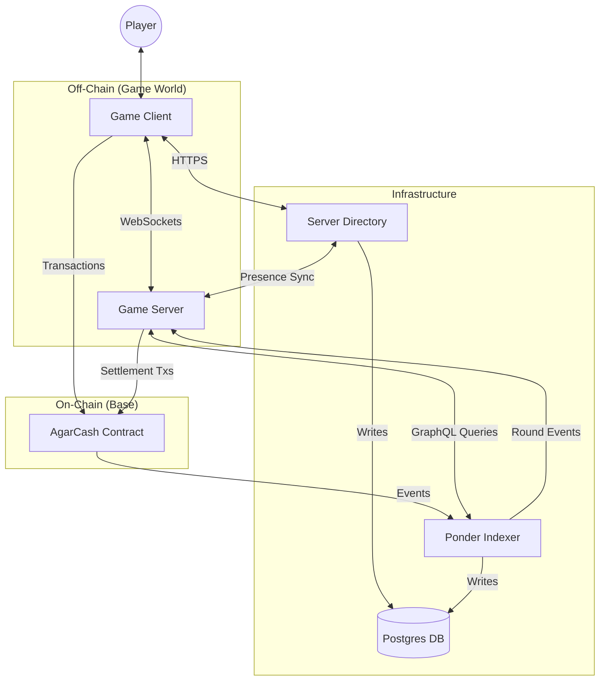
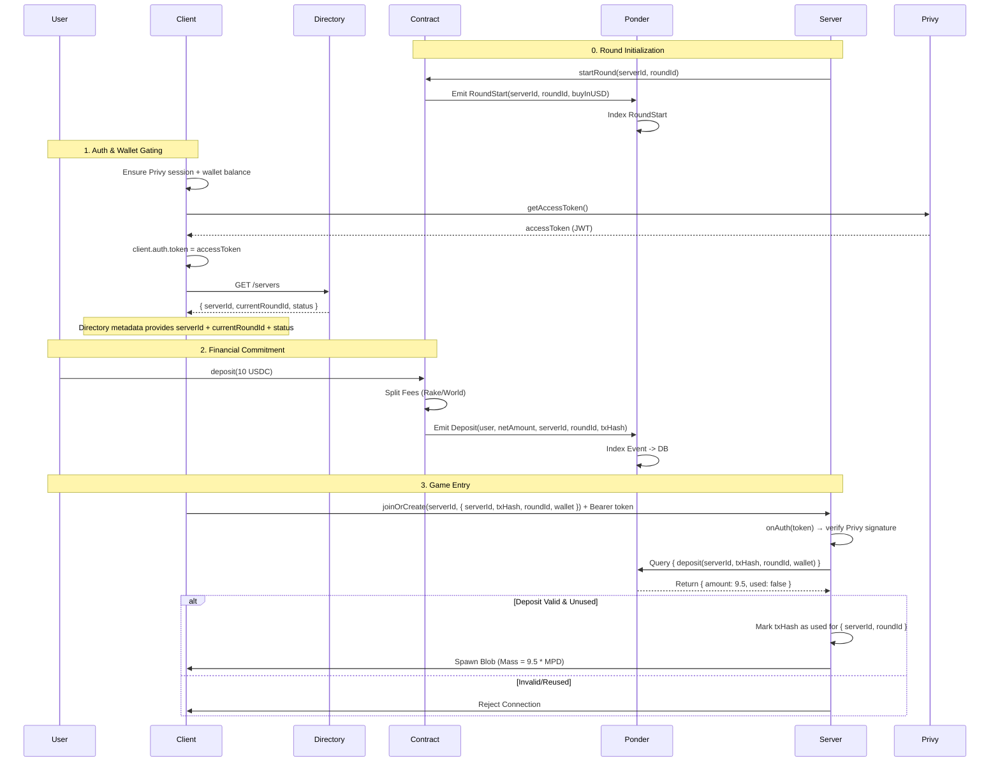
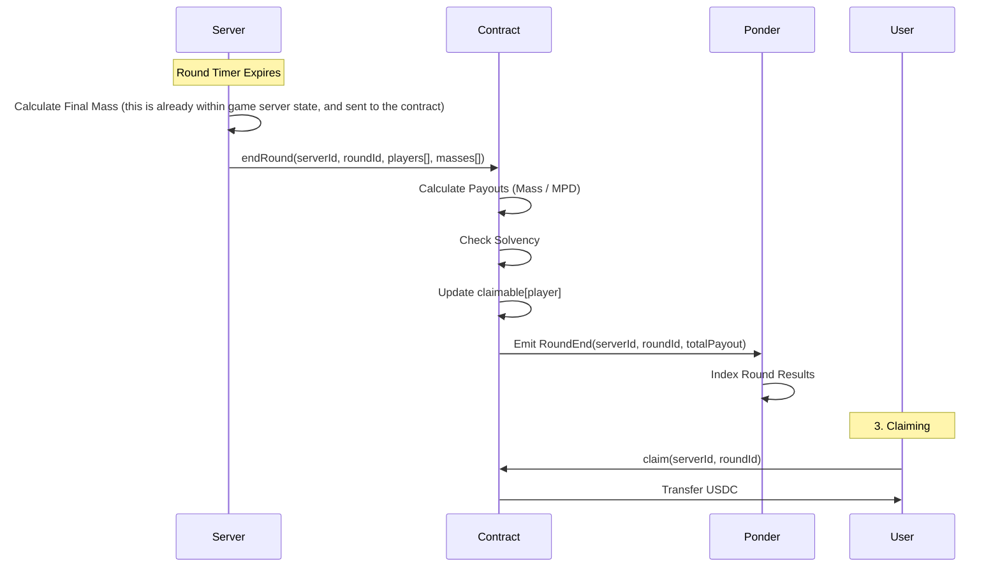
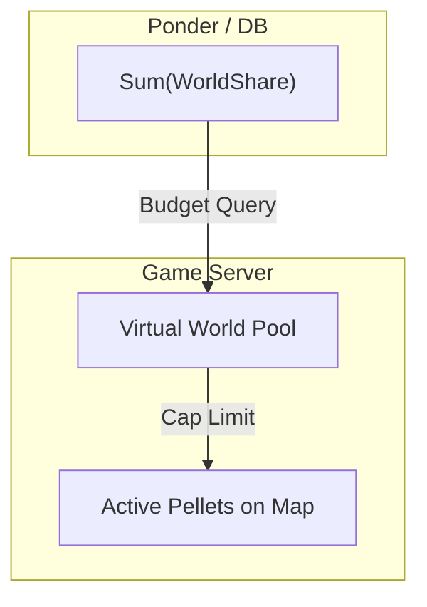
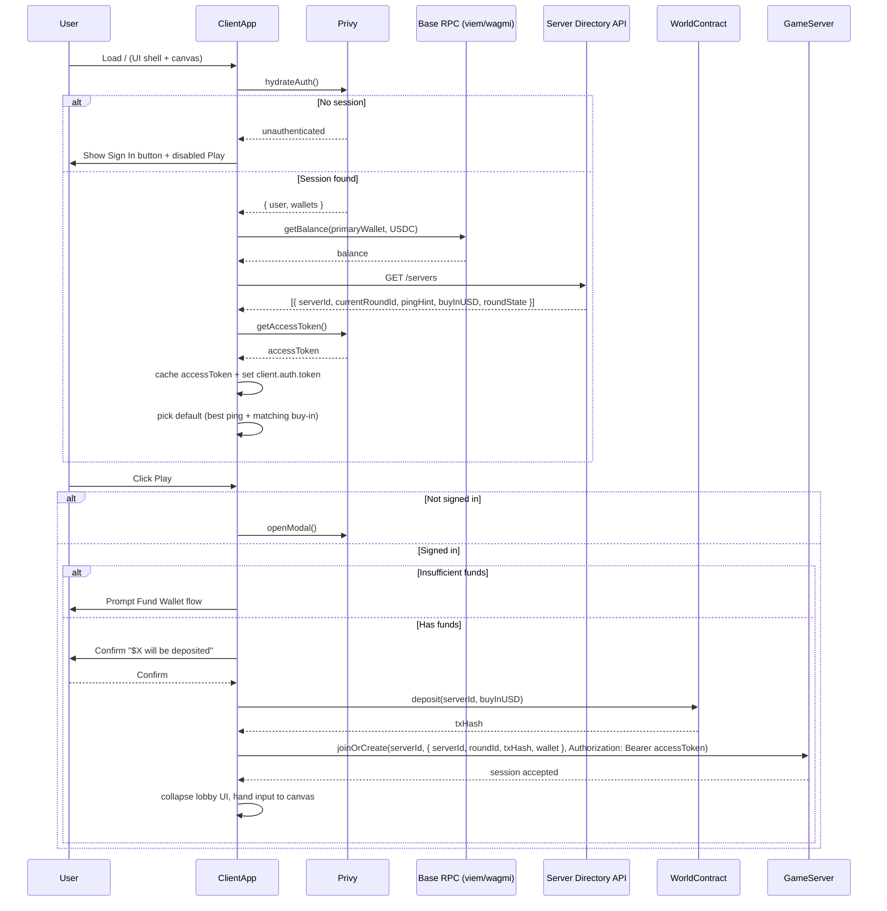
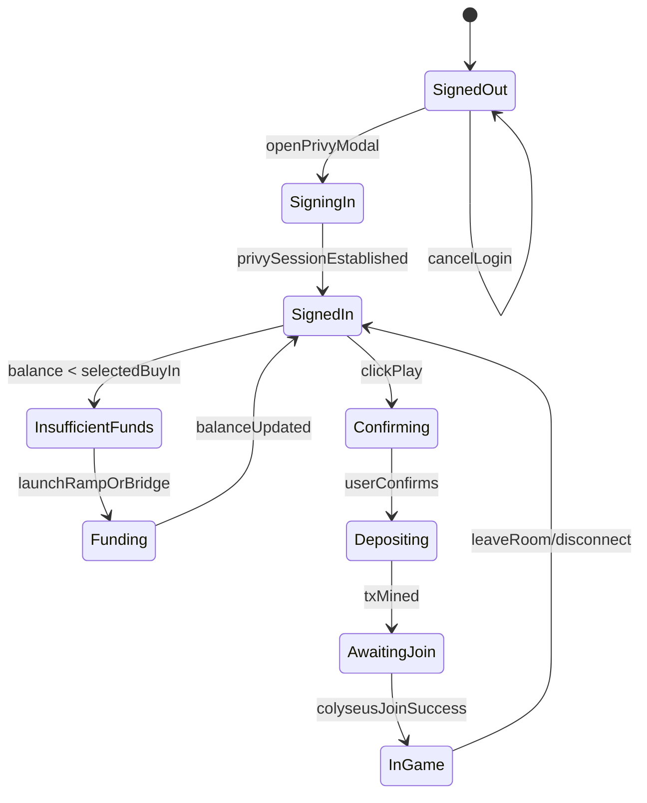
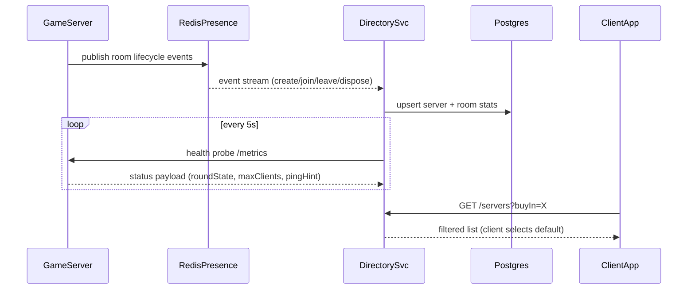
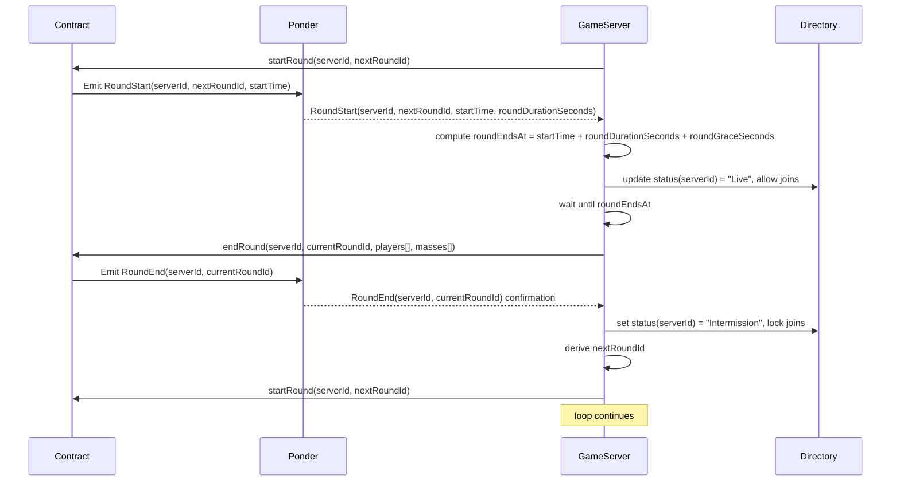

# AgarCash System Architecture

## 1. High-Level Overview

The system consists of five main components:
1.  **Client**: The player's interface (React/Canvas/Privy) plus lobby UX.
2.  **Game Server**: Authoritative game logic (Colyseus/Express/Node.js/Typescript).
3.  **Server Directory**: Aggregates presence data from every server and exposes REST endpoints so the client can discover/filter worlds.
4.  **Smart Contract**: Economic settlement and custody (Solidity/Base).
5.  **Indexer (Ponder)**: Real-time event indexing, solvency tracking, and round lifecycle streaming.

---

## 2. Component Interfaces

### 2.1 Smart Contract (`World.sol`)
**Role:** Custody, Upfront Fee Splitting, Final Settlement, and authoritative registry for every Game Server.

*   **Server Registry**
    *   `servers[bytes32 serverId]`: stores `{ controller, buyInUSD, configHash, currentRoundId, roundDurationSeconds, roundGraceSeconds, spawnMultiplier, maxPelletValue }`.
    *   `addServer(serverId, controller, buyInUSD, config)`: admin-only. Adds/updates an entry so new servers can come online without redeploying contracts.
    *   `removeServer(serverId)`: admin-only. Immediately locks deposits/round actions for that server.

*   **Config Storage:**
    *   `roundDurationSeconds` / `roundGraceSeconds` live inside each `servers[serverId]` entry so different shards can run different cadences.
    *   Economy knobs such as `spawnMultiplier`, `maxPelletValue`, or future curve parameters are also scoped per `serverId`.

*   **Write Interfaces (all scoped by `serverId`):**
    *   `startRound(bytes32 serverId, bytes32 roundId)`: Callable only by the registered controller address. Sets `currentRoundId`, stamps `roundStart`, and emits `RoundStart(serverId, roundId, …)`.
    *   `deposit(bytes32 serverId, uint256 amount)`: User funds whichever `currentRoundId` is active for that server. Contract emits `Deposit(..., serverId, roundId, txHash, ...)`.
    *   `endRound(bytes32 serverId, bytes32 roundId, address[] players, uint256[] finalMasses)`: Controller settles the round after the configured duration/grace window.
    *   `claim(bytes32 serverId, bytes32 roundId)`: Player withdraws winnings for a specific round/server pair to prevent cross-shard replay.

*   **Events (Listened to by Ponder):**
    *   `AddedServer(serverId, controller, buyInUSD, configHash)`
    *   `RemovedServer(serverId)`
    *   `RoundStart(serverId, roundId, uint256 buyInUSD)`
    *   `Deposit(address player, uint256 spawnAmount, bytes32 serverId, bytes32 roundId, bytes32 txHash, ...)`
    *   `RoundEnd(serverId, roundId, uint256 totalPayout)`
    *   `Claim(address player, uint256 amount, bytes32 serverId, bytes32 roundId)`

### 2.2 Ponder Indexer
**Role:** Validates per-round deposits, tracks solvency, exposes round lifecycle for gating joins.

*   **Ingestion:** Listens to `ServerRegistered`, `RoundStart`, `Deposit`, `RoundEnd`, and `Claim` events emitted by the single `World.sol`, always keyed by `serverId`.
*   **Subscriptions:** Streams `RoundStart`/`RoundEnd` notifications (per `serverId`) to the Game Server via WebSocket or Redis pub/sub so each controller can align its countdown with the on-chain source of truth.
*   **GraphQL API (Consumed by Server/Client):**
    *   `deposit(id: txHash)` / `depositByAddress(serverId, roundId, address)`: Verify that a wallet funded the current server/round, the tx was confirmed, and it has not been consumed.
    *   `roundState(serverId, roundId)`: Returns `status`, `startBlock`, `endBlock`, `buyInUSD`, and the authoritative controller address.
    *   `claimable(serverId, roundId, address)`: Mirrors `claim(serverId, roundId)` readiness so the client can surface post-round UX.
    *   `playerStats(address)`: Historical wins/losses (optional but handy for UX).
    *   `worldPoolBalance()`: Computed aggregate of `worldShare` from all deposits vs. payouts.
*   **Data Model**
    *   `servers` table: `{ serverId (PK), controller, buyInUSD, configHash, roundDurationSeconds, roundGraceSeconds, spawnMultiplier, maxPelletValue, lastHeartbeatBlock }`.
    *   `rounds` table: `{ serverId, roundId, status (Pending|Live|Ended|Settled), startBlock, endBlock, totalDeposits, totalPayout, createdAt, updatedAt }`.
    *   `deposits` table: `{ txHash (PK), serverId, roundId, player, amount, spawnMass, used (bool), blockNumber, timestamp }`.
    *   `claims` table: `{ claimTxHash (PK), serverId, roundId, player, amount, status, blockNumber }`.
    *   Aggregates cached in Redis: `{ worldPoolBalance, outstandingClaims }` to answer solvency queries quickly.

### 2.3 Game Server (`GameRoom.ts`)
**Role:** Physics, State Sync, Pellet Spawning, Session Verification.

*   **WebSocket Messages:**
    *   `input`: { x, y } vectors from client.
    *   `split`: Action command.
*   **Internal Logic:**
    *   `static async onAuth(token, options, context)`: Uses the Privy verification key to validate the bearer token provided by the client (`context.token`) before the room spins up; rejects immediately on invalid/expired tokens.
    *   `onJoin(client, options, auth)`: Called only after `onAuth` succeeds; validates `{ serverId, txHash, roundId, wallet }` via Ponder to ensure the user deposited for the active round on this shard and that the deposit hasn’t been consumed. `auth` contains the verified Privy claims for identity binding.
    *   `roundClock`: Subscribes to Ponder `RoundStart(serverId, roundId)` events, reads the per-server `roundDurationSeconds` from the contract config, computes `roundEndsAt`, and closes the lobby until the start event is seen. When the countdown elapses (plus `roundGraceSeconds`), it invokes `endRound()`.
    *   `update()`: Runs physics loop (20-60Hz).
    *   `endRound()`: Calculates final mass and submits to Contract with its assigned `serverId`.
    *   `startRoundLoop()`: After `RoundEnd(serverId, roundId)` is observed via Ponder, waits for settlement finality, computes the next `roundId`, calls `startRound(serverId, roundId)` on the contract, and only re-opens matchmaking once Ponder echoes the fresh `RoundStart`.
    *   `presenceHeartbeat()`: Publishes `{ serverId, status, players, currentRoundId, roundEndsAt }` into Redis Presence so the Directory and homepage stay synchronized.

### 2.4 Client (`RootApp.tsx`)
**Role:** The full game client (canvas + UI shell). Orchestrates identity, wallet balance checks, Directory-backed server discovery, and the "Play" CTA before handing control to the Colyseus room.

*   **Auth & Identity**
    *   On page load, call Privy to hydrate `authState`. Maintain `session`, `user`, `linkedWallets`.
    *   Immediately fetch a short-lived Privy access token via `getAccessToken()` (React hook) and refresh it whenever `authState` changes so outbound API calls and Colyseus joins can be signed.
    *   Navbar shows `Sign In` when no Privy session; otherwise display `username`, `primaryWallet`, `USDC balance`.
    *   Login/sign-up modal is the same surface triggered by navbar and by the `Play` button guard.
*   **Balances & Funding**
    *   Uses `viem/wagmi` `getBalance` against Base RPC for the selected wallet.
    *   Maintains `selectedBuyInUSD`. If `walletBalance < buyIn`, surface `Fund Wallet` panel (ramps or bridging).
*   **Server Discovery UI**
    *   On mount call the Directory’s `GET /servers` once, cache the full set of active servers plus metadata (status, ping hint, region, `serverId`, live round info, `currentRoundId`).
    *   Provide tabs for buy-in presets (`$1`, `$5`, `$10`, custom) that **filter locally** within the cached dataset, along with a searchable dropdown for all regions/instances.
    *   Best-ping suggestion: run lightweight RTT probe against each server’s `/healthz` endpoint and pre-select the lowest latency option.
*   **CTA & Consent Flow**
    *   Giant `Play` button remains visible regardless of auth state.
    *   Guards (in order): requires Privy session → successful Privy access token refresh → sufficient funds → user confirmation that `$X` will be deposited → triggers the contract call for the shared `World.sol`.
    *   The selected server entry already carries `serverId` + `currentRoundId`, so after the deposit transaction is accepted, the client issues the Colyseus `joinOrCreate` request with `{ serverId, roundId, txHash, wallet }` and includes the Privy access token as the Colyseus auth header, then collapses the pre-game UI once the server verifies the token plus deposit with the indexer.
    *   If `roundState !== "Live"` for the chosen server, the CTA swaps to a countdown/intermission state and prevents the Colyseus join request altogether because the room remains locked until `RoundStart` is observed.
*   **Game Canvas Integration**
    *   The UI shell communicates with the canvas via a shared context/store (`GameClientProvider`), allowing overlays to toggle without reloading the WebGL scene.
    *   When the player exits/disconnects, the lobby shell re-opens and re-fetches balances and server availability to keep the experience fresh.

### 2.5 Server Directory & Lobby Feed
**Role:** Provide the homepage with real-time knowledge of every Colyseus server, its buy-in tier, round status, and entry contract.

*   **Metadata Contract**
    *   All servers share a single `World.sol` deployment. The Directory mirrors the on-chain registry (`ServerRegistered` events) into `{ serverId, controller, buyInUSD, configHash, rpcUrl }`.
*   **Colyseus Hooks**
    *   Every room definition uses `gameServer.define("agar_world", GameRoom, { buyInUSD })` plus `.filterBy(['buyInUSD', 'maxClients'])`, `.sortBy({ clients: 1 })`, and `.enableRealtimeListing()` so that Lobby consumers can subscribe to status changes ([Colyseus Server docs](https://docs.colyseus.io/server)).
    *   Presence/Driver backends (Redis) keep the directory coherent across horizontally scaled processes; `RedisPresence` enables cross-process room discovery while a custom driver persists room metadata for API reads.
*   **Directory API**
    *   `GET /servers`: returns the whole active set (`serverId`, `roundState`, `currentRoundId`, `playersOnline`, `availableSlots`, `avgPing`, `region`, `buyInUSD`, `worldContract`) so clients can filter locally without repeated network calls.
    *   `GET /servers/:id`: deeper stats (per `serverId`) plus the transport endpoint used by the client to open the Colyseus WebSocket.
    *   `GET /servers/:id/ping`: lightweight JSON response for browser RTT probing.
*   **Health / Lifecycle**
    *   Servers emit `create`, `lock`, `unlock`, `dispose` lifecycle events to the directory service for monitoring.
    *   Shutdown hooks call `gameServer.onBeforeShutdown` and `gracefullyShutdown()` to remove entries cleanly before process exits.
*   **Data Flow**
    *   Directory service mirrors active rooms into Postgres (or Redis hash) for the homepage.
    *   A separate cron refreshes stale entries and reconciles with infrastructure (Kubernetes, Fly, etc.) to ensure the UI never shows dead instances.
*   **Redis Presence Schema**
    *   Each `GameRoom` registers itself under `world:${roomId}` with fields: `{ serverId, machineId, processId, buyInUSD, currentRoundId, roundEndsAt, status, players, maxClients, wsEndpoint, worldContract }`.
    *   Secondary indexes: `presence.sadd(worlds:${buyInUSD}, roomId)` for quick filtering by stake, and `presence.hset(machine:${machineId}, roomId, status)` to let orchestration know how many rooms each box hosts.
    *   Presence TTLs are refreshed every heartbeat; when a room shuts down gracefully it deletes its keys so the directory never surfaces ghost worlds.
*   **Process vs. Machine Layout**
    *   A single machine can host multiple `GameRoom` instances (e.g., `$1` and `$5` buy-ins) and each instance becomes its own presence entry (`roomId` as primary key).
    *   Horizontal scaling is done by bringing up more machines, but the presence schema doesn’t care—rooms from different machines share the same namespace while still exposing their `machineId` for observability.
    *   If we ever need multiple rooms of the same buy-in on one machine (for load shedding), they simply register unique `roomId`s; the homepage still treats them as separate worlds because buyers choose the exact server they’ll join.
*   **Persistent Directory Store**
    *   `servers` table in Postgres mirrors on-chain + presence data: `{ serverId (PK), controller, region, buyInUSD, status, currentRoundId, roundEndsAt, avgPing, playersOnline, availableSlots, wsEndpoint, rpcUrl, lastPresenceAt }`.
    *   `metrics` table: `{ serverId, cpu, mem, tickRate, updatedAt }` derived from health probes.
    *   Cached JSON response of `GET /servers` stored in Redis (`directory:servers`) so clients can fetch quickly; invalidated whenever presence updates or on-chain registry events arrive.

### 2.6 Auth & Session Security
**Role:** Make sure only Privy-authenticated wallets that have deposited into the current round can ever reach gameplay.

*   **Client Responsibilities**
    *   After Privy login, call `getAccessToken()` and inject the token both into backend REST calls and the Colyseus JS client via `client.auth.token = accessToken`.
    *   Include `{ serverId, roundId, txHash, wallet }` inside the `spawnPayload`, while the Privy token rides in the `Authorization` header automatically handled by Colyseus once `client.auth.token` is set.
*   **Server Responsibilities**
    *   `GameRoom.static onAuth(token, options, context)`: Verifies the Privy JWT using the configured verification key. Rejects immediately (before room instantiation) for invalid/expired tokens or mismatched app IDs.
    *   `GameRoom.onJoin(client, options, auth)`: Receives `auth` (Privy claims) and cross-checks deposit data with the Indexer before letting the player spawn. Marks `txHash` as consumed only after token + deposit pass.
*   **Indexer & Contract Coupling**
    *   Deposits emit `{ serverId, roundId }`, so the indexer exposes `depositByAddress(serverId, roundId, wallet)` to the Game Server. The round cannot begin until `startRound(serverId, roundId)` fires, ensuring the client picks up the fresh `currentRoundId`.
*   **Failure Handling**
    *   Expired Privy tokens bounce at `onAuth` and bubble a `ServerError` back to the browser so the overlay can re-run `getAccessToken()` and retry.
    *   Deposit mismatches throw from `onJoin`, resulting in a client-facing error that re-opens the overlay instead of putting the user into the world.

---

## 3. Key Flows

### 3.1 Deposit & Verified Spawn
This flow ensures deposits are tied to a specific server/round pair and cannot be replayed. The client gates everything behind Privy session + wallet auth, learns each server’s `{ serverId, currentRoundId }` from the directory feed, and the Game Server refuses to spawn a player unless both the Privy token and the deposit for that exact `serverId` can be verified.

### 3.2 Round End & Settlement
The server acts as the oracle for game results.

### 3.3 Pellet Spawning (Economy)
The server ensures it doesn't spawn more value than exists in the "World Pool".

### 3.4 Homepage Session & Play CTA
This diagram captures the full client-side decision tree from landing to spawning.

### 3.5 UI State Machine (Client Shell)

### 3.6 Server Directory Sync
The directory aggregates real-time state from every Colyseus server and exposes it to the overlay.

### 3.7 Round Automation Loop
Servers derive timing from on-chain config, trust `RoundStart` events emitted by the contract, and only open matchmaking while a round is officially live.

