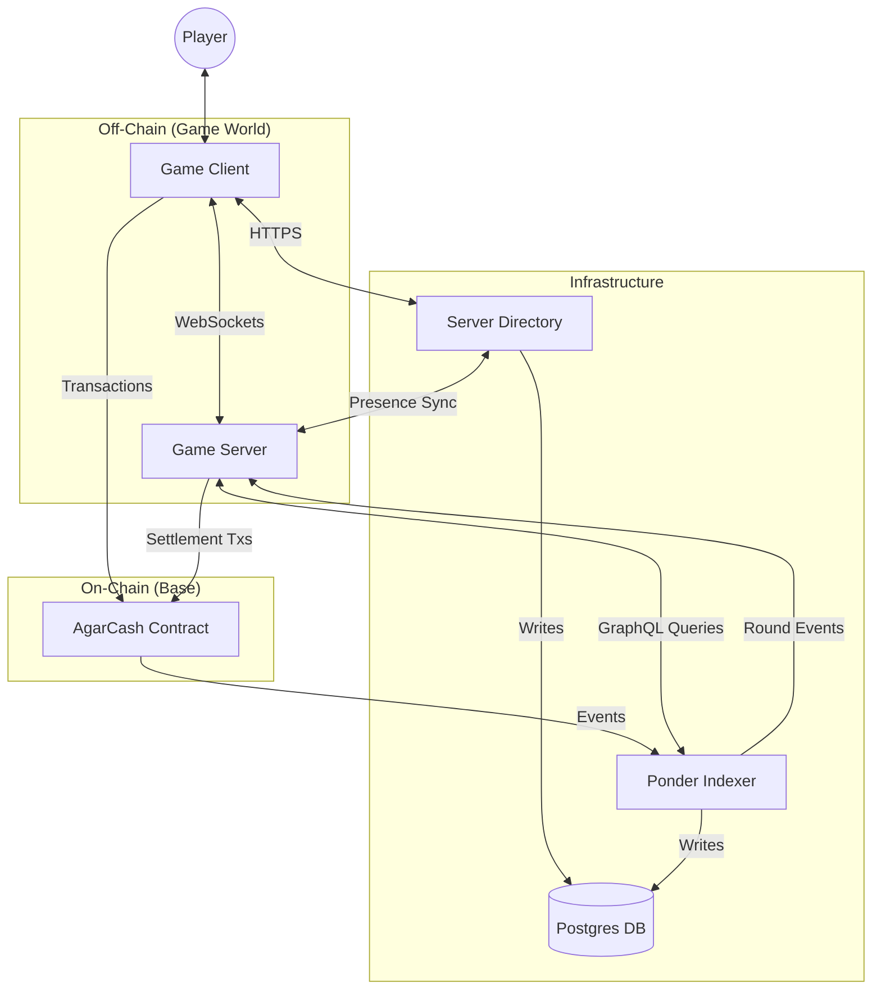
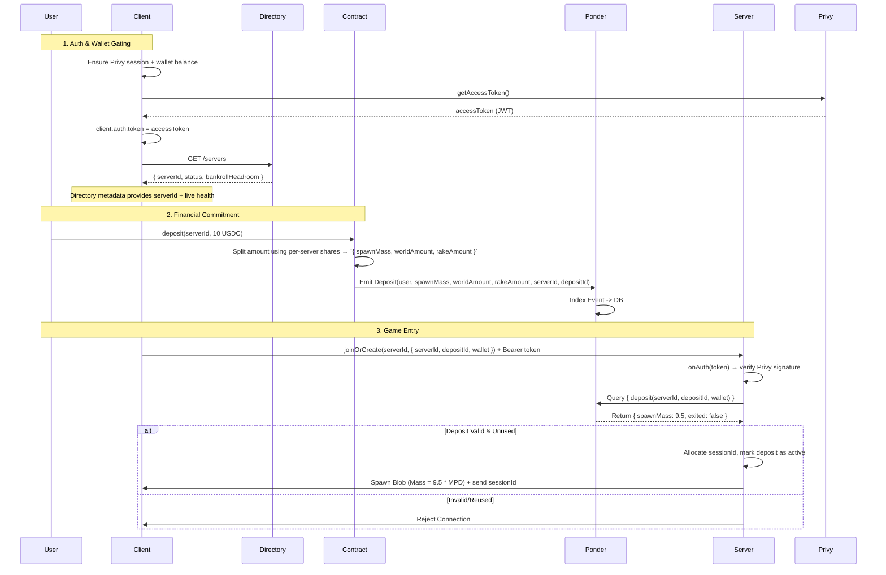
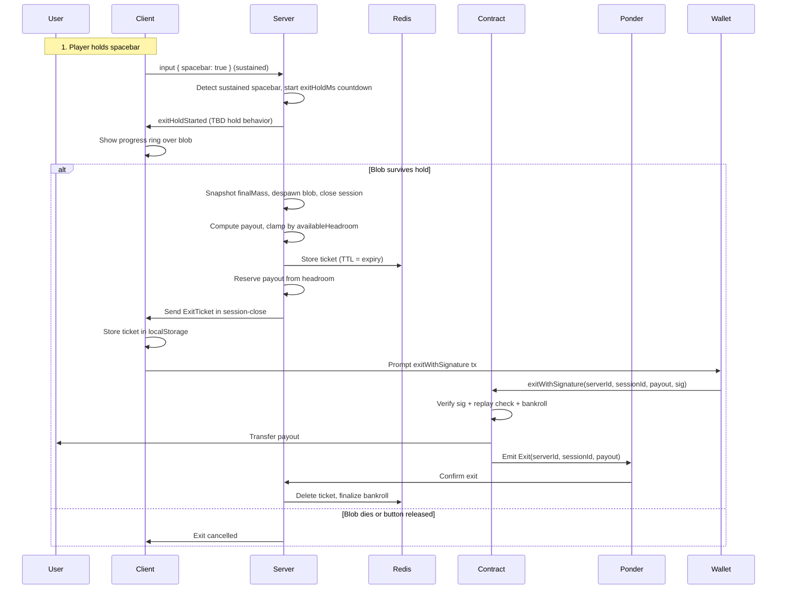
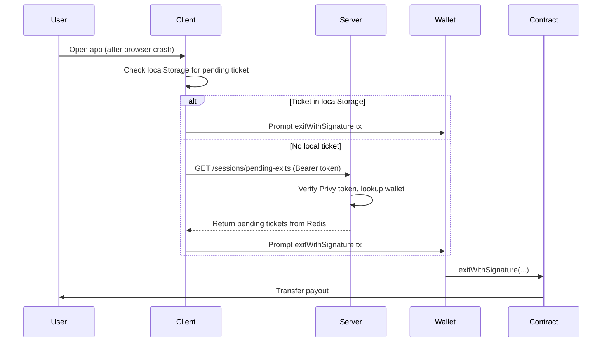
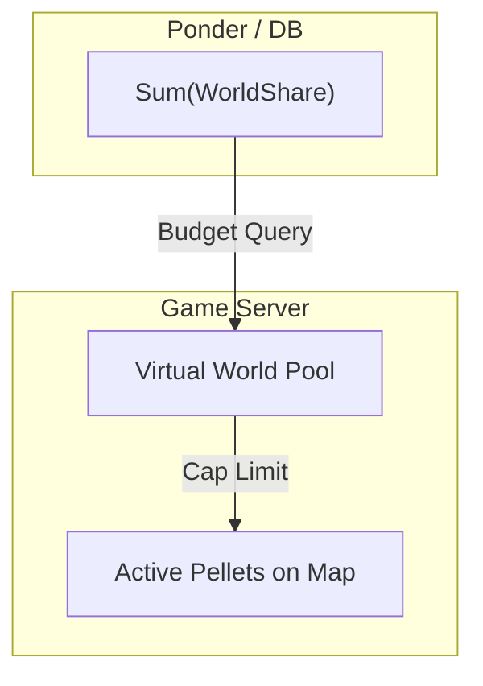
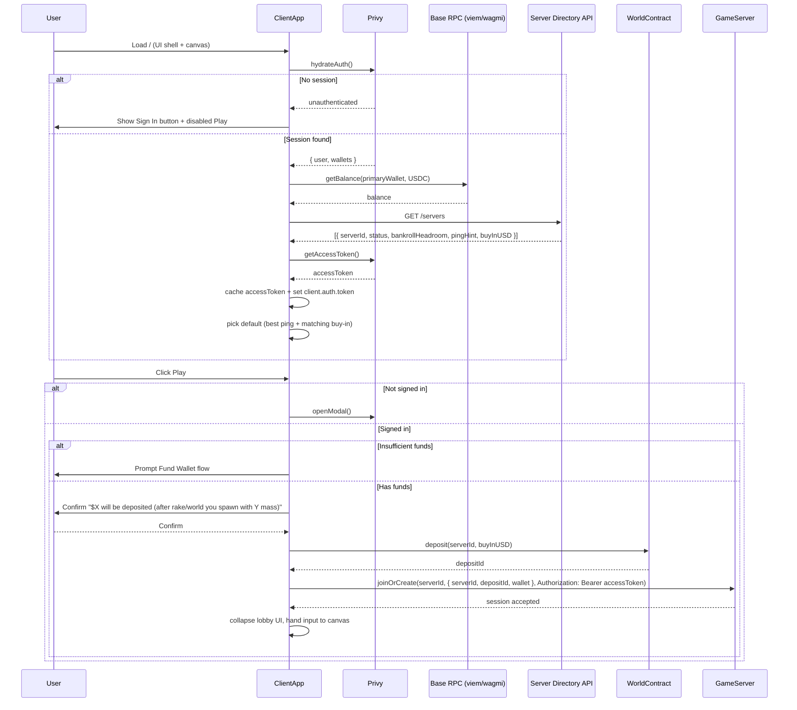
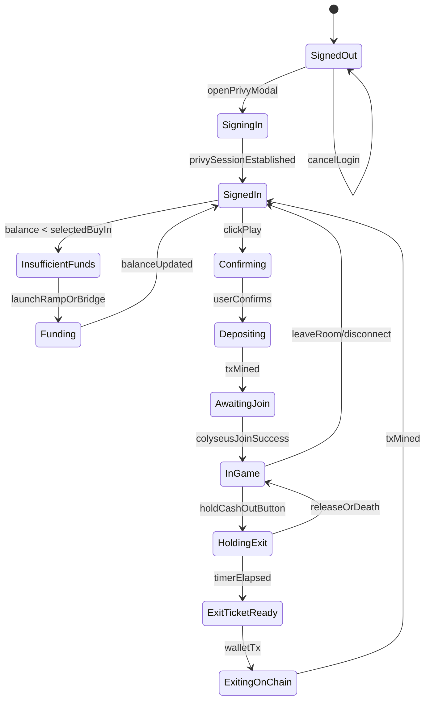
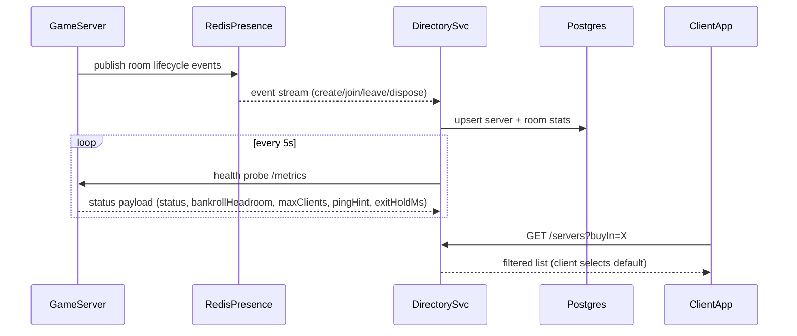
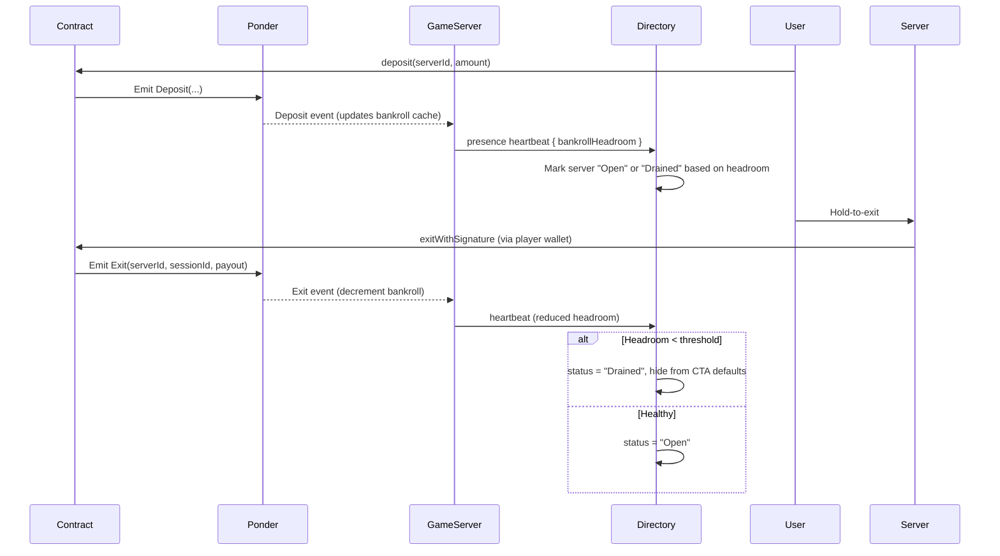

# AgarCash System Architecture

## 1. High-Level Overview

The system consists of five main components:
1.  **Client**: The player's interface (React/Canvas/Privy) plus lobby UX.
2.  **Game Server**: Authoritative game logic (Colyseus/Express/Node.js/Typescript).
3.  **Server Directory**: Aggregates presence data from every server and exposes REST endpoints so the client can discover/filter worlds.
4.  **Smart Contract**: Economic settlement and custody (Solidity/Base).
5.  **Indexer (Ponder)**: Real-time event indexing, solvency tracking, and round lifecycle streaming.

---

## 2. Component Interfaces

### 2.1 Smart Contract (`World.sol`)
**Role:** Custody, upfront fee splitting, continuous settlement, and authoritative registry for every Game Server.

*   **Server Registry**
    *   `servers[bytes32 serverId]`: stores `{ controller, buyInUSD, configHash, massPerDollar, rakeShareBps, worldShareBps, exitHoldMs }`.
    *   `addServer(serverId, controller, buyInUSD, config)`: admin-only. Adds/updates an entry so new servers can come online without redeploying contracts.
    *   `removeServer(serverId)`: admin-only. Immediately locks deposits/exits for that server.

*   **Economy Parameters (per `serverId`):**
    *   `massPerDollar`: deterministic conversion between spawned mass and USD for that shard.
    *   `rakeShareBps` / `worldShareBps`: basis-point splits used to route value to the developer and the shared world pool. Whatever remains becomes the playable spawn budget (escrowed in `serverBankroll[serverId]`).
    *   `exitHoldMs`: milliseconds a player must hold spacebar to successfully cash out; tunable per server to balance risk/reward.

*   **Write Interfaces (all scoped by `serverId`):**
    *   `deposit(bytes32 serverId, uint256 amount)`: User funds a session. The contract splits the amount into `{ spawnAmount, worldAmount, rakeAmount }`, transfers rake/world shares immediately, credits `serverBankroll[serverId] += spawnAmount`, and emits `Deposit(player, spawnAmount, worldAmount, rakeAmount, serverId, depositId)`.
    *   `exitWithSignature(bytes32 serverId, bytes32 sessionId, uint256 payout, bytes signature)`: Player-triggered withdraw. Verifies that the payload was signed by the registered `controller`, checks `payout <= serverBankroll[serverId]`, checks `exitedSessions[serverId][sessionId] == false` (replay protection), marks session as exited, debits the bankroll, and transfers `payout` to the player. Gas is paid by the player.
    *   (Optional) `cancelDeposit(serverId, depositId)`: Used if a player never joins after depositing; refunds `spawnAmount` minus fees.

*   **Storage (replay protection):**
    *   `exitedSessions[serverId][sessionId]`: `bool` — prevents the same exit ticket from being claimed twice.

*   **Events (Listened to by Ponder):**
    *   `AddedServer(serverId, controller, buyInUSD, configHash, massPerDollar, rakeShareBps, worldShareBps, exitHoldMs)`
    *   `RemovedServer(serverId)`
    *   `Deposit(address player, uint256 spawnAmount, uint256 worldAmount, uint256 rakeAmount, bytes32 serverId, bytes32 depositId)`
    *   `Exit(address player, bytes32 serverId, bytes32 sessionId, uint256 payout)`

### 2.2 Ponder Indexer
**Role:** Validates per-round deposits, tracks solvency, exposes round lifecycle for gating joins.

*   **Ingestion:** Listens to `AddedServer`, `RemovedServer`, `Deposit`, and `Exit` events emitted by the single `World.sol`, always keyed by `serverId`.
*   **Subscriptions:** Streams deposit confirmations and controller exit approvals to each Game Server via WebSocket or Redis pub/sub so off-chain state can mirror on-chain solvency.
*   **GraphQL API (Consumed by Server/Client):**
    *   `deposit(id: txHash)` / `depositByAddress(serverId, address)`: Verify that a wallet funded the server, the tx was confirmed, and it has not been fully exited.
    *   `sessionBalance(serverId, address)`: Returns the net spawn budget remaining for an account (deposits - exits).
    *   `exitHistory(serverId, address)`: Mirrors past exits so the client can show lifetime profitability.
    *   `playerStats(address)`: Historical wins/losses (optional but handy for UX).
    *   `worldPoolBalance()`: Computed aggregate of `worldShare` from all deposits vs. payouts.
*   **Data Model**
    *   `servers` table: `{ serverId (PK), controller, buyInUSD, configHash, massPerDollar, rakeShareBps, worldShareBps, exitHoldMs, lastHeartbeatBlock }`.
    *   `deposits` table: `{ depositId (PK), serverId, player, amount, spawnMass, rakeAmount, worldAmount, exitedAmount, blockNumber, timestamp }`.
    *   `sessions` table: `{ serverId, sessionId, player, depositId, spawnedMass, exitRequestedAt, exitCompletedAt, finalPayout }`.
    *   `exits` table: `{ exitTxHash (PK), serverId, sessionId, player, payout, blockNumber }`.
    *   Aggregates cached in Redis: `{ worldPoolBalance, outstandingDeposits }` to answer solvency queries quickly.

### 2.3 Game Server (`GameRoom.ts`)
**Role:** Physics, State Sync, Pellet Spawning, Session Verification.

*   **WebSocket Messages:**
    *   `input`: { x, y, spacebar } — movement vectors plus spacebar state from client. Sustained `spacebar: true` triggers the exit hold countdown.
*   **Internal Logic:**
    *   `static async onAuth(token, options, context)`: Uses the Privy verification key to validate the bearer token provided by the client (`context.token`) before the room spins up; rejects immediately on invalid/expired tokens.
    *   `onJoin(client, options, auth)`: Called only after `onAuth` succeeds; validates `{ serverId, depositId, wallet }` via Ponder to ensure the user deposited for this shard and that the deposit hasn’t been fully exited. Issues a `sessionId`, records spawn mass, and binds `auth` (verified Privy claims) to the physics entity.
    *   `sessionManager`: Tracks per-client spawn mass, deficit (because of rake/world), and accumulated gains/losses. Exposes APIs to start/stop the **Hold-to-Exit Timer**.
    *   `exitController`: Triggered when sustained `spacebar: true` is detected in the input stream:
        1.  Marks the blob as "exiting" and applies TBD exit-hold behavior (slowdown, shrink, freeze, etc.).
        2.  Starts a countdown (`exitHoldMs`, configurable per server). If spacebar is released or the blob dies, cancel the exit and resume gameplay.
        3.  On success: snapshots final mass, converts to payout using `massPerDollar`, clamps by `availableHeadroom`, despawns blob, closes session.
        4.  Signs `ExitTicket { serverId, sessionId, player, payout, nonce, expiry }` and persists it in Redis (`exit_ticket:{serverId}:{sessionId}`, TTL = expiry).
        5.  Reserves payout from bankroll headroom (`availableHeadroom -= payout`) so concurrent exits don't overdraw.
        6.  Sends ticket to client in the session-close message; on `Exit` event confirmation from indexer, deletes ticket and finalizes bankroll deduction.
    *   `update()`: Runs physics loop (20-60Hz), applies mass decay, and enforces transfer inefficiencies so feeding collusion stays costly.
    *   `presenceHeartbeat()`: Publishes `{ serverId, status, players, exitHoldMs, bankrollHeadroom }` into Redis Presence so the Directory and homepage stay synchronized.

### 2.4 Client (`RootApp.tsx`)
**Role:** The full game client (canvas + UI shell). Orchestrates identity, wallet balance checks, Directory-backed server discovery, and the "Play" CTA before handing control to the Colyseus room.

*   **Auth & Identity**
    *   On page load, call Privy to hydrate `authState`. Maintain `session`, `user`, `linkedWallets`.
    *   Immediately fetch a short-lived Privy access token via `getAccessToken()` (React hook) and refresh it whenever `authState` changes so outbound API calls and Colyseus joins can be signed.
    *   Navbar shows `Sign In` when no Privy session; otherwise display `username`, `primaryWallet`, `USDC balance`.
    *   Login/sign-up modal is the same surface triggered by navbar and by the `Play` button guard.
*   **Balances & Funding**
    *   Uses `viem/wagmi` `getBalance` against Base RPC for the selected wallet.
    *   Maintains `selectedBuyInUSD`. If `walletBalance < buyIn`, surface `Fund Wallet` panel (ramps or bridging).
*   **Server Discovery UI**
    *   On mount call the Directory’s `GET /servers` once, cache the full set of active servers plus metadata (status, ping hint, region, `serverId`, live round info, `currentRoundId`).
    *   Provide tabs for buy-in presets (`$1`, `$5`, `$10`, custom) that **filter locally** within the cached dataset, along with a searchable dropdown for all regions/instances.
    *   Best-ping suggestion: run lightweight RTT probe against each server’s `/healthz` endpoint and pre-select the lowest latency option.
*   **CTA & Consent Flow**
    *   Giant `Play` button remains visible regardless of auth state.
    *   Guards (in order): requires Privy session → successful Privy access token refresh → sufficient funds → user confirmation that `$X` will be deposited (highlighting rake/world shares so they understand the starting deficit) → triggers `deposit(serverId, amount)` on `World.sol`.
    *   After the deposit transaction is accepted, the client issues the Colyseus `joinOrCreate` request with `{ serverId, depositId, wallet }`, includes the Privy access token as the Colyseus auth header, and collapses the pre-game UI once the server verifies the deposit with the indexer.
    *   Because there's no round gating, availability depends on bankroll headroom; servers that fall below a threshold are marked “Drained” and the CTA nudges users toward healthier shards.
*   **Hold-to-Exit UX**
    *   Exit is triggered by holding the **spacebar** (same input channel as gameplay). When the server detects sustained spacebar input, it starts the exit countdown (`exitHoldMs`, configurable per server). The UI renders a progress ring over the blob.
    *   **Blob behavior during hold:** TBD — could be frozen, slowed, shrinking, or some other penalty. Will be finalized alongside the physics/server-authority model.
    *   If spacebar is released or the blob dies, the exit is cancelled and normal gameplay resumes.
    *   Once the hold completes, the server **despawns the blob, closes the session**, and issues an `ExitTicket`. The ticket is persisted server-side (Redis) and sent to the client in the session-close payload. The UI stores the ticket in `localStorage` as backup and immediately prompts the wallet for `exitWithSignature()`.
    *   If the browser closes before the tx lands, the client checks `localStorage` on next load and/or calls `GET /sessions/pending-exits` (Privy-auth-gated) to retrieve any unclaimed tickets.
    *   Tickets have a generous expiry (e.g., 24h). If unclaimed by expiry, the reservation is released back to bankroll and the payout is forfeited.
*   **Game Canvas Integration**
    *   The UI shell communicates with the canvas via a shared context/store (`GameClientProvider`), allowing overlays (deposit form, exit hold overlay, post-exit summary) to toggle without reloading the WebGL scene.
    *   When the player exits/disconnects, the lobby shell re-opens and re-fetches balances, session history, and leaderboard stats to keep the experience fresh.

### 2.5 Server Directory & Lobby Feed
**Role:** Provide the homepage with real-time knowledge of every Colyseus server, its buy-in tier, round status, and entry contract.

*   **Metadata Contract**
    *   All servers share a single `World.sol` deployment. The Directory mirrors the on-chain registry (`AddedServer`/`RemovedServer` events) into `{ serverId, controller, buyInUSD, configHash, rpcUrl }`.
*   **Colyseus Hooks**
    *   Every room definition uses `gameServer.define("agar_world", GameRoom, { buyInUSD })` plus `.filterBy(['buyInUSD', 'maxClients'])`, `.sortBy({ clients: 1 })`, and `.enableRealtimeListing()` so that Lobby consumers can subscribe to status changes ([Colyseus Server docs](https://docs.colyseus.io/server)).
    *   Presence/Driver backends (Redis) keep the directory coherent across horizontally scaled processes; `RedisPresence` enables cross-process room discovery while a custom driver persists room metadata for API reads.
*   **Directory API**
    *   `GET /servers`: returns the whole active set (`serverId`, `roundState`, `currentRoundId`, `playersOnline`, `availableSlots`, `avgPing`, `region`, `buyInUSD`, `worldContract`) so clients can filter locally without repeated network calls.
    *   `GET /servers/:id`: deeper stats (per `serverId`) plus the transport endpoint used by the client to open the Colyseus WebSocket.
    *   `GET /servers/:id/ping`: lightweight JSON response for browser RTT probing.
*   **Health / Lifecycle**
    *   Servers emit `create`, `lock`, `unlock`, `dispose` lifecycle events to the directory service for monitoring.
    *   Shutdown hooks call `gameServer.onBeforeShutdown` and `gracefullyShutdown()` to remove entries cleanly before process exits.
*   **Data Flow**
    *   Directory service mirrors active rooms into Postgres (or Redis hash) for the homepage.
    *   A separate cron refreshes stale entries and reconciles with infrastructure (Kubernetes, Fly, etc.) to ensure the UI never shows dead instances.
*   **Redis Presence Schema**
    *   Each `GameRoom` registers itself under `world:${roomId}` with fields: `{ serverId, machineId, processId, buyInUSD, bankrollHeadroom, status (Open|Drained|Maintenance), players, maxClients, wsEndpoint, worldContract }`.
    *   Secondary indexes: `presence.sadd(worlds:${buyInUSD}, roomId)` for quick filtering by stake, and `presence.hset(machine:${machineId}, roomId, status)` to let orchestration know how many rooms each box hosts.
    *   Presence TTLs are refreshed every heartbeat; when a room shuts down gracefully it deletes its keys so the directory never surfaces ghost worlds.
*   **Process vs. Machine Layout**
    *   A single machine can host multiple `GameRoom` instances (e.g., `$1` and `$5` buy-ins) and each instance becomes its own presence entry (`roomId` as primary key).
    *   Horizontal scaling is done by bringing up more machines, but the presence schema doesn’t care—rooms from different machines share the same namespace while still exposing their `machineId` for observability.
    *   If we ever need multiple rooms of the same buy-in on one machine (for load shedding), they simply register unique `roomId`s; the homepage still treats them as separate worlds because buyers choose the exact server they’ll join.
*   **Persistent Directory Store**
    *   `servers` table in Postgres mirrors on-chain + presence data: `{ serverId (PK), controller, region, buyInUSD, massPerDollar, rakeShareBps, worldShareBps, exitHoldMs, status, bankrollHeadroom, avgPing, playersOnline, availableSlots, wsEndpoint, rpcUrl, lastPresenceAt }`.
    *   `metrics` table: `{ serverId, cpu, mem, tickRate, updatedAt }` derived from health probes.
    *   Cached JSON response of `GET /servers` stored in Redis (`directory:servers`) so clients can fetch quickly; invalidated whenever presence updates or on-chain registry events arrive.

### 2.6 Auth & Session Security
**Role:** Make sure only Privy-authenticated wallets that have deposited into the selected server can ever reach gameplay, and that exit tickets cannot be forged or replayed.

*   **Client Responsibilities**
    *   After Privy login, call `getAccessToken()` and inject the token both into backend REST calls and the Colyseus JS client via `client.auth.token = accessToken`.
    *   Include `{ serverId, depositId, wallet }` inside the `spawnPayload`, while the Privy token rides in the `Authorization` header automatically handled by Colyseus once `client.auth.token` is set.
    *   When an exit ticket arrives, the client prompts the user to call `exitWithSignature(serverId, sessionId, payout, signature)` directly from their wallet so gas is self-sponsored.
*   **Server Responsibilities**
    *   `GameRoom.static onAuth(token, options, context)`: Verifies the Privy JWT using the configured verification key. Rejects immediately (before room instantiation) for invalid/expired tokens or mismatched app IDs.
    *   `GameRoom.onJoin(client, options, auth)`: Receives `auth` (Privy claims) and cross-checks deposit data with the Indexer before letting the player spawn. Marks `depositId` as “active session” only after token + deposit pass.
    *   `exitController`: Produces exit tickets signed with the server’s controller key; includes `sessionId`, `payout`, `nonce`, and `expiry` to prevent replay.
*   **Indexer & Contract Coupling**
    *   Deposits emit `{ serverId, depositId }`, so the indexer exposes `depositByAddress(serverId, wallet)` plus the active session footprint to the Game Server. Exits are confirmed by watching `Exit` events, allowing the server/client to show final balances.
*   **Failure Handling**
    *   Expired Privy tokens bounce at `onAuth` and bubble a `ServerError` back to the browser so the overlay can re-run `getAccessToken()` and retry.
    *   Deposit mismatches throw from `onJoin`, resulting in a client-facing error that re-opens the overlay instead of putting the user into the world.

### 2.7 Exit Ticket Persistence
**Role:** Ensure players can claim their exit payout even if the browser closes before the tx lands.

*   **Redis Ticket Store**
    *   Key: `exit_ticket:{serverId}:{sessionId}` → `{ ticket, player, payout, reservedAt }`.
    *   TTL matches ticket `expiry` (e.g., 24h). Auto-deletes on expiry.
    *   On `Exit` event confirmation from indexer, ticket is deleted and bankroll reservation is finalized.
    *   If TTL fires before claim, reservation is released back to `availableHeadroom`.

*   **Bankroll Reservation**
    *   `availableHeadroom = serverBankroll − sum(activeReservations)`.
    *   Prevents concurrent exits from overdrawing; new exits are clamped by `availableHeadroom`, not raw bankroll.

*   **REST Endpoint**
    *   `GET /sessions/pending-exits`: Returns all unclaimed tickets for the authenticated wallet. **Requires Privy access token**; server verifies the caller owns the wallet before returning tickets.
    *   Response: `[{ serverId, sessionId, payout, expiry, signature, ... }]`.

*   **Client Recovery Flow**
    *   On page load, check `localStorage` for cached tickets.
    *   Call `GET /sessions/pending-exits` to fetch any server-persisted tickets.
    *   If valid ticket exists, prompt wallet to call `exitWithSignature()`.

*   **Contract Replay Protection**
    *   `exitedSessions[serverId][sessionId]` mapping prevents the same ticket from being claimed twice.

---

## 3. Key Flows

### 3.1 Deposit & Verified Spawn
This flow ensures deposits are tied to a specific server and cannot be replayed. The client gates everything behind Privy session + wallet auth, learns each server’s `{ serverId, status }` from the directory feed, and the Game Server refuses to spawn a player unless both the Privy token and the deposit for that exact `serverId` can be verified. Because rake and world shares are skimmed immediately, every player spawns at an intentional deficit and must hunt to get positive PnL.

### 3.2 Hold-to-Exit & Settlement
Players can cash out at any time, but they must survive the exit hold window and pay their own gas to withdraw. The server acts as the oracle by signing an exit ticket only after the blob remains alive for the entire countdown.

### 3.3 Exit Ticket Recovery
If the browser closes before the wallet tx lands, the client can recover the ticket on next visit.

### 3.4 Pellet Spawning (Economy)
The server ensures it doesn't spawn more value than exists in the "World Pool".

`massPerDollar` from the contract registry ensures every deposit’s `spawnMass` matches the physics economy. The indexer captures that value straight from the `Deposit` event, so the Virtual Pool can be reconciled against on-chain truth at any time.

### 3.5 Homepage Session & Play CTA
This diagram captures the full client-side decision tree from landing to spawning.

### 3.6 UI State Machine (Client Shell)

### 3.7 Server Directory Sync
The directory aggregates real-time state from every Colyseus server and exposes it to the overlay.

### 3.8 Bankroll Health Loop
Without fixed rounds, solvency is managed continuously. Deposits top up each server’s bankroll, exits drain it, and the Directory throttles matchmaking when headroom falls below safety thresholds.

