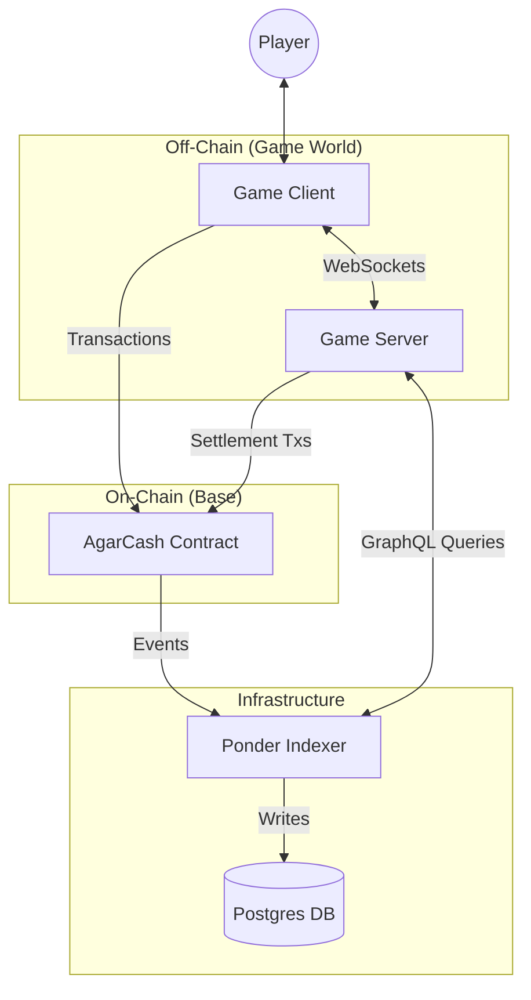
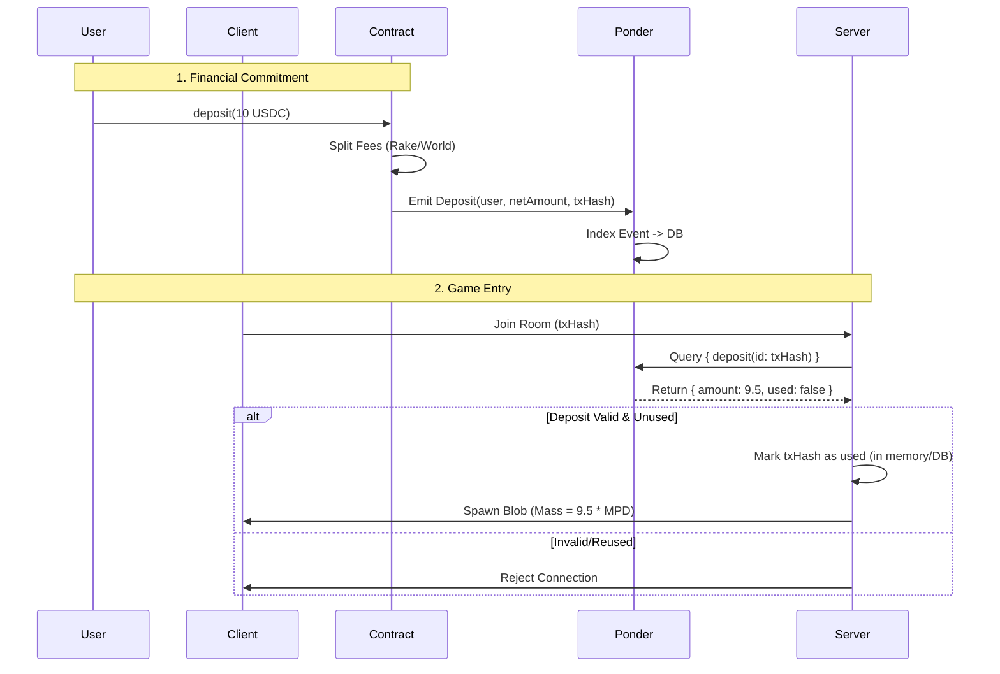
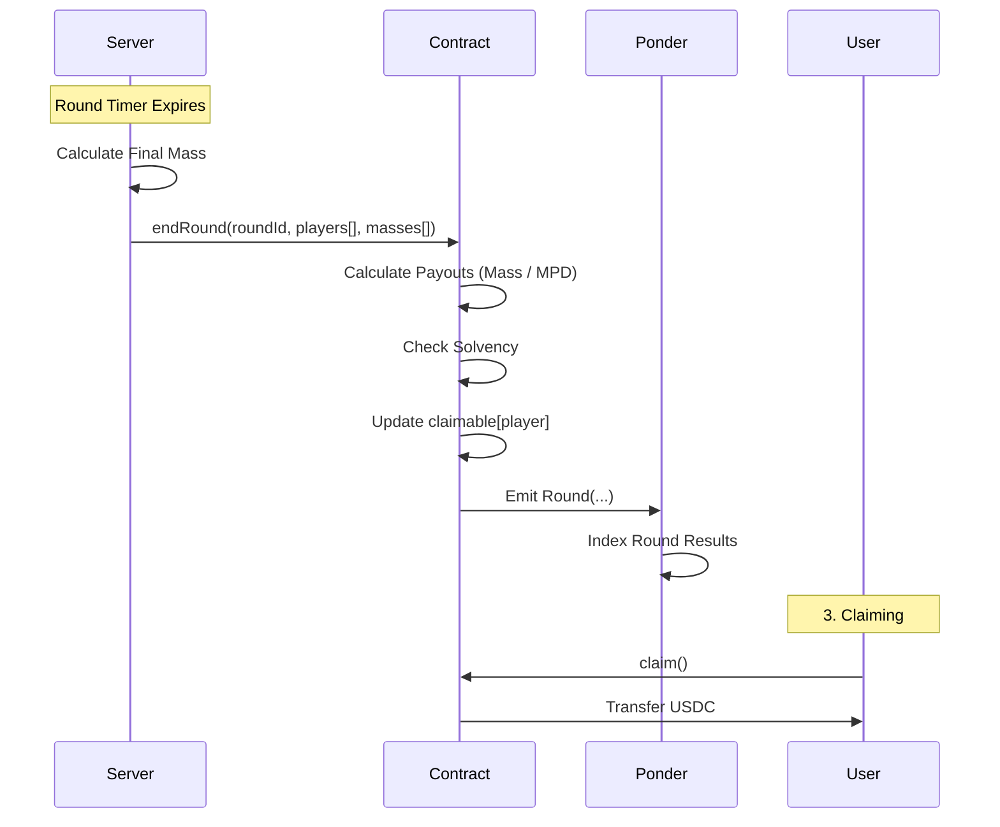

# AgarCash System Architecture

## 1. High-Level Overview

The system consists of four main components:
1.  **Client**: The player's interface (React/Pixi.js).
2.  **Game Server**: Authoritative game logic (Colyseus/Node.js).
3.  **Smart Contract**: Economic settlement and custody (Solidity/Base).
4.  **Indexer (Ponder)**: Real-time event indexing and data serving.



---

## 2. Component Interfaces

### 2.1 Smart Contract (`AgarCash.sol`)
**Role:** Custody, Upfront Fee Splitting, Final Settlement.

*   **Write Interfaces:**
    *   `deposit(uint256 amount)`: User sends funds. Splits to Treasury/WorldPool/Spawn.
    *   `endRound(bytes32 roundId, address[] players, uint256[] finalMasses)`: Server settles the game.
    *   `claim()`: User pulls their winnings.
*   **Events (Listened to by Ponder):**
    *   `Deposit(address player, uint256 spawnAmount, ...)`
    *   `Round(bytes32 roundId, uint256 totalPayout)`
    *   `Claim(address player, uint256 amount)`

### 2.2 Ponder Indexer
**Role:** Validates deposits, tracks solvency, provides historical data.

*   **Ingestion:** Listens to Base RPC for `AgarCash` events.
*   **GraphQL API (Consumed by Server/Client):**
    *   `deposit(id: txHash)`: Verify a specific deposit happened and wasn't used yet.
    *   `playerStats(address)`: Historical wins/losses.
    *   `worldPoolBalance()`: Computed aggregate of `worldShare` from all deposits vs. payouts.

### 2.3 Game Server (`GameRoom.ts`)
**Role:** Physics, State Sync, Pellet Spawning, Session Verification.

*   **WebSocket Messages:**
    *   `input`: { x, y } vectors from client.
    *   `split`: Action command.
*   **Internal Logic:**
    *   `onJoin(options)`: Validates `options.txHash` via Ponder to ensure the user deposited.
    *   `update()`: Runs physics loop (20-60Hz).
    *   `endRound()`: Calculates final mass and submits to Contract.

---

## 3. Key Flows

### 3.1 Deposit & Verified Spawn
This flow ensures "Stateless Deposits" are secure. The server doesn't blindly trust the client; it verifies the deposit via the Indexer.



### 3.2 Round End & Settlement
The server acts as the oracle for game results.



### 3.3 Pellet Spawning (Economy)
The server ensures it doesn't spawn more value than exists in the "World Pool".

```mermaid
graph LR
    subgraph "Ponder / DB"
        TotalDeposits[Sum(WorldShare)]
    end
    
    subgraph "Game Server"
        VirtualPool[Virtual World Pool]
        ActivePellets[Active Pellets on Map]
        
        VirtualPool -- "Cap Limit" --> ActivePellets
    end
    
    TotalDeposits -->|Query Budget| VirtualPool
```

