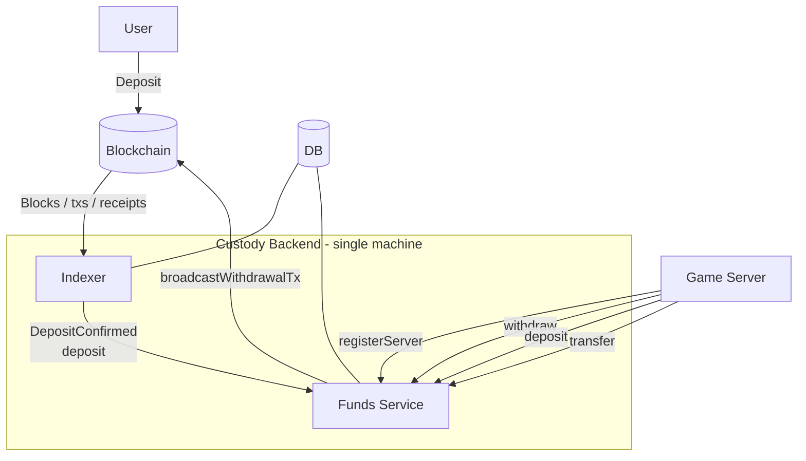
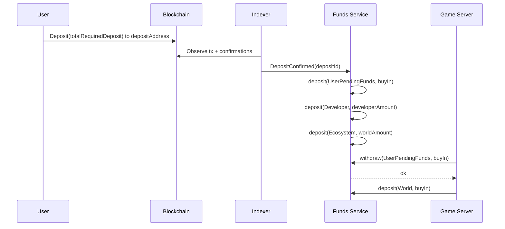
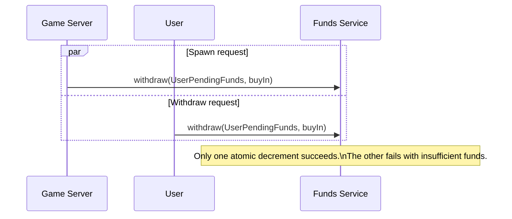

# Exchange-Style Custody Redesign (No Smart Contract)

## High-level summary

We remove the on-chain smart contract as the coordination and custody layer and replace it with an **exchange-style custodial system**:

- Each game server (or shard) controls a **custodial wallet** (or sub-account) that receives user deposits.
- A backend **Indexer** watches the chain for inbound deposits to those addresses and waits for **N confirmations** before crediting user balances.
- The Game Server only allows spawning when the player has **confirmed, available balance** for that server.
- Cash-outs become **withdrawals** from custody: the backend authorizes and submits on-chain payouts (hot wallet), with risk controls.
- “World mass” / pellet spawning is funded from an internal **world reserve** sub-ledger (like a house pool) rather than a contract-held world pool.

This is “more centralized, like an exchange”: custody + ledger + risk controls live off-chain, and on-chain is used only for **deposits and withdrawals**.

---

## Block diagram (custody + ledger)



---

## Core concepts

### 0) Separation of responsibilities (important)

We split the system into two servers:

- **Funds Service** (custody + ledger + solvency): maintains balances, confirmations, and deposits within multiple accounts. **It does not know anything about the game world** (no positions, no physics, no entities). It only moves funds between accounts and enforces invariants.
- **Game Server** (gameplay): runs Colyseus + simulation. It calls the Funds Service to:
  - check spawn eligibility (by checking pending accounts),
  - reserve/consume a spawn credit (by withdrawing from `UserPendingFunds` and crediting `WorldAccount`),
  - spend from or deposit back to the world reserve based on gameplay events,
  - request a withdrawal after a successful exit.

---

## Future design requirements (Funds Service + DB)

This section defines the **future** behavior and data model for the custodial system (no contract dependency). Treat it as the requirements/spec for implementation.

### 1) Server registry + parameters (per serverId)

Store these in the Funds Service DB as canonical per-server config:
  - `serverId`
  - `depositAddress` (custody address)
  - `buyInAmountWei`
  - `massPerEth`
  - `developerFeeBps`
  - `worldFeeBps`
  - `exitHoldMs`
  - `status` (`active|paused_deposits|paused_spawns|paused_withdrawals|disabled`)

### 2) Buy-in enforcement

- Indexer observes **all** inbound deposits.
- Funds Service marks deposits as:
  - `valid=true` if `amountWei >= totalRequiredDeposit` and server status allows deposits
  - `valid=false` otherwise (still stored/indexed, but not spawn-eligible)
- Only `valid=true` deposits participate in spawn eligibility.

### 3) Fee splitting (developerAmount vs worldAmount vs spawnAmount)

We are adopting a **"fee-on-top" model** (additive) instead of a deduction model.

If a user wants to spawn with `$5` worth of mass, they pay `$5` + fees.
The goal is for the user to see exactly their buy-in amount as their in-game mass.

**Parameters (per server config)**:
- `buyInAmountWei`: The base amount that converts to mass (e.g. 0.001 ETH).
- `developerFeeBps`: Percentage added for developer revenue (e.g. 2.5%).
- `worldFeeBps`: Percentage added for world reserve funding (e.g. 1.0%).

**Calculation**:
- `spawnAmountWei` = `buyInAmountWei` (this is what the user gets in mass).
- `developerAmountWei` = `buyInAmountWei * developerFeeBps / 10000`.
- `worldAmountWei` = `buyInAmountWei * worldFeeBps / 10000`.
- `totalRequiredDeposit` = `spawnAmountWei + developerAmountWei + worldAmountWei`.

**Custody equivalent**
- For each confirmed deposit we first decide **validity** (business rule):
  - `valid=true` if `amountWei >= totalRequiredDeposit` (exact match preferred, or handle overpayment as extra credit).
  - `valid=false` otherwise.

**If `valid=true`**
- On confirmation, we split the incoming `totalRequiredDeposit`:
  - `spawnAmountWei` → credit `UserPendingFundsAccount` (this matches the base buy-in).
  - `developerAmountWei` → credit `DeveloperAccount`.
  - `worldAmountWei` → credit `EcosystemAccount`.

**Result**:
- The user sees `UserPendingFunds = spawnAmountWei`.
- When they spawn, they consume `spawnAmountWei` and get exactly that much mass.
- Fees are already stripped and allocated to internal accounts upon deposit confirmation.

**If `valid=false`**
- Credit **all** funds to `UserPendingFundsAccount` (or a `SuspenseAccount`) but mark as "insufficient for spawn". User can top up or withdraw.


### 4) Correctness + custody reconciliation (simple model)

We keep this intentionally simple:

- **Correctness invariant (ledger-level)**:
  - Every spend path (spawn or cashout) must go through `withdraw(UserPendingFunds, amountWei)` which atomically enforces:
    - `UserPendingFunds.balanceWei >= amountWei`
    - then decrements the balance

- **Execution invariant (chain-level, withdrawals only)**:
  - Before broadcasting a withdrawal tx, Funds Service must ensure the custody wallet can actually send:
    - `walletBalanceWei >= payoutWei + gasBufferWei`

- **Reconciliation (ops safety)**:
  - Continuously reconcile:
    - on-chain balances per custody address
    - vs. Funds Service account totals (what we believe we hold / owe per server)
  - Alert on mismatches, stalled indexing, or abnormal outflows.

### 5) Replay protection (double-withdraw / double-claim)

- Introduce an idempotency key at Funds Service level:
  - `exitId` (or `cashoutId`) unique per successful in-game cashout
  - enforce `UNIQUE(serverId, exitId)` so the same exit cannot create two withdrawals.
- If we keep a “hold-to-exit” flow, the Game Server must pass a stable `exitId` when requesting withdrawal creation.

### 6) Server Registration (`registerServer`)

Instead of a centralized `addServer` admin flow, we use a **Game Server-driven registration** flow authenticated by keys.

**Auth Model**:
- **Funds Service**: Holds `CustodyKeys` (one per server) in KMS/Env to sign on-chain txs.
- **Game Server**: Holds a separate `ServerAuthKey` (standard ETH private key) to sign API requests.
- **Trust**: Funds Service maintains an allow-list mapping: `ServerAuthAddress → CustodyKeyId`.

**Flow**:
1. **Game Server** boots up with local config (`buyIn`, `fees`, `chainId`) + `ServerAuthKey`.
2. **Game Server** calls `FundsService.registerServer({ payload, signature })`.
   - `payload`: `{ serverId, chainId, buyInAmount, fees, timestamp }`
   - `signature`: Signed hash of payload using `ServerAuthKey`.
3. **Funds Service**:
   - Recovers address from signature.
   - Verifies address is in the allow-list and maps to a valid `CustodyKey`.
   - Upserts **Server Registry** (stores config, active status).
   - Triggers **Indexer** to watch the associated `DepositAddress` (if new).
   - Ensures system accounts (`World`, `Ecosystem`, `Developer`) exist.
4. **Result**: Server is now "live" in the Funds Service; deposits will be indexed, and Game Server can call spawn/withdraw APIs using the same `ServerAuthKey`.

**Key Management (MVP)**:
- We can pre-generate N key pairs (`CustodyKey`, `ServerAuthKey`).
- Load them into Funds Service config.
- Distribute `ServerAuthKey` to each Game Server instance securely (env var).
- *Security Note*: If `ServerAuthKey` is leaked, attacker can request withdrawals but NOT sign arbitrary txs (limited by Funds Service API logic). If `CustodyKey` is leaked, attacker drains wallet. Thus, separating them is safer.

### 7) World pool top-ups (receive())

- Treat treasury top-ups as a first-class “deposit type”:
  - either credit `EcosystemAccount` directly when funds arrive from a whitelisted treasury address,
  - or record as `HouseAssetTopUp` and move into reserve via policy.

### 1) Custody accounts

- **Per-server deposit address**: each serverId maps to a custody wallet/address on the target chain.
- Internally we treat each server as a **sub-account** (like “exchange sub-ledgers”).

**Best practice**: use **one master custody system** with deterministic sub-accounts (HD wallets) or a custody provider, rather than ad-hoc private keys per server.

### 2) Double-entry ledger (source of truth off-chain)

Like an exchange, we maintain a ledger with:

- **Assets (on-chain custody)**: funds controlled by our custody wallets.
- **Liabilities (user balances)**: what we owe users.
- **Internal equity / revenue accounts**: rake/fees.
- **Internal reserve accounts**: “world reserve” that funds pellet spawning.

We never “derive balances by summing deposits minus withdrawals on the fly” for gameplay decisions. Instead we:

- record deposits/withdrawals as immutable ledger entries,
- compute balances by aggregation,
- and reconcile ledger vs chain state continuously.

### 3) Confirmations, reorg safety, and pending states

Deposits are not spendable until they are “final enough”:

- `pending` (seen in mempool / 0 conf)
- `confirming` (1..N-1 conf)
- `confirmed` (>= N conf) → becomes **available to spawn**
- `reorged` (was seen, later removed) → rollback ledger credit

### 4) Risk controls (withdrawals)

Withdrawals are the main “exchange risk surface.” We must implement:

- withdrawal queue + rate limits
- per-user and per-server limits
- manual review thresholds
- hot/warm/cold separation
- signing isolation (HSM/KMS)
- monitoring + alarms

---

## Flows

### A) Deposit → confirm → credit → spawn (fee-on-top)

1. **User deposits** `totalRequiredDeposit` to the server’s `depositAddress`.
2. **Indexer** observes the tx and writes a `deposits` row.
3. After **N confirmations**, Indexer emits `DepositConfirmed(depositId)` to Funds Service.
4. **Funds Service** computes (per server config):
   - `spawnAmountWei = buyInAmountWei`
   - `developerAmountWei = buyInAmountWei * developerFeeBps / 10_000`
   - `worldAmountWei = buyInAmountWei * worldFeeBps / 10_000`
   - `totalRequiredDeposit = spawnAmountWei + developerAmountWei + worldAmountWei`
5. **Funds Service** credits (idempotent):
   - `deposit(UserPendingFunds, spawnAmountWei)`
   - `deposit(DeveloperAccount, developerAmountWei)`
   - `deposit(EcosystemAccount, worldAmountWei)`
6. **Game Server** allows join/spawn only if user has `UserPendingFunds >= buyInAmountWei`.
7. **On spawn**, Game Server calls:
   - `withdraw(UserPendingFunds, buyInAmountWei)` (atomic)
   - `deposit(WorldAccount, buyInAmountWei)` (mass enters world)

### B) Pellet spawning + recycling

- **Pellet spawn**:
  - `withdraw(EcosystemAccount, pelletCostWei)` (atomic; if insufficient, no pellets)
  - `deposit(WorldAccount, pelletCostWei)` (mass enters world)
- **Recycling / burns**:
  - Game Server emits an accounting delta (value reclaimed)
  - Funds Service applies: `transfer(WorldAccount → EcosystemAccount, reclaimedWei)`

### C) Exit / cashout → withdrawal

1. Player exits; Game Server computes `payoutWei`.
2. Game Server requests withdrawal:
   - `withdraw(UserPendingFunds, payoutWei)` (atomic)
3. Funds Service creates an on-chain payout tx from custody and broadcasts it.
4. Indexer confirms the payout tx and Funds Service records finality.

## Balance model (terminology)

To avoid ambiguity, we’ll use a **Funds Service chart of accounts** (per `serverId`) and map our old terms onto it.

### Accounts (per serverId)

- **`DeveloperAccount`**: internally accrued fees (developer share).
- **`EcosystemAccount`**: budget used to fund pellet spawning (world share).
- **`WorldAccount`**: tracks value currently deployed into the game world.

Additionally, we have **one** user-facing balance:
- **`UserPendingFundsAccount`**: per user, per server — where newly confirmed deposits land (base spawn amount).

### Mapping to previous terminology

- **`WorldReserve`** → `EcosystemAccount`
- **`WorldFloat`** → `WorldAccount`

### World movements (the core economic model)

- **Player spawn**: `UserPendingFundsAccount → WorldAccount` (consumes `spawnAmountWei`)
- **Pellet spawn**: `EcosystemAccount → WorldAccount`
- **Recycling / burns**: `WorldAccount → EcosystemAccount`

This makes `WorldAccount` a real accounting bucket. The Funds Service does **not** need map knowledge, only periodic deltas/events.

---

## Account data structure (single generic type + ACL)

All accounts share the same structure. The only differences are:
- `kind` (what the account represents)
- `owner` (server-wide vs user-specific)
- ACL (who can call which operations)

Suggested structure:

```ts
type AccountKind =
  | "UserPendingFunds"
  | "Developer"
  | "Ecosystem"
  | "World";

type OwnerType = "server" | "user";

type Account = {
  id: string; // stable unique id
  serverId: string;
  chainId: number;
  asset: "ETH";
  kind: AccountKind;
  ownerType: OwnerType;
  ownerId: string | null; // wallet/userId if ownerType=user
  balanceWei: bigint;
  // Access control is enforced by Funds Service and persisted so it is auditable.
  // This is the set of principals allowed to call debit-like operations on this account.
  // (Exact schema can be a bitmask or join table.)
  acl: {
    canDeposit: AccessEntity[];
    canWithdraw: AccessEntity[]; // debit / spend from this account
    canTransfer: AccessEntity[]; // move out of this account via transfer
  };
  createdAt: number;
  updatedAt: number;
};
```

Suggested auth principal type:

```ts
type AccessEntity =
  | { kind: "indexer" }
  | { kind: "admin" }
  | { kind: "developer" } // ops/dev treasury controller
  // If kind is game_server, we must scope it to a specific serverId.
  | { kind: "game_server"; serverId: string }
  // If kind is user, we must scope it to a specific on-chain wallet address.
  | { kind: "user"; wallet: string };
```

### Access rights (high-level)

Access rights are **per-account**. They are defined by the Funds Service on first startup (or on `registerServer`) and stored in DB alongside each account so the policy is auditable and consistent across restarts.

Example policy shape (subject to your final decisions):
- **Indexer principal**:
  - can `deposit` into: `UserPendingFunds`, `Developer`, `Ecosystem` (on confirmed deposits)
- **Game Server principal**:
  - can `withdraw` / `transfer` from: gameplay-authorized accounts (see questions below)
  - cannot withdraw developer funds
- **Developer principal**:
  - can `withdraw` from: `DeveloperAccount`
- **Admin principal**:
  - emergency/manual overrides (paused state, sweeps, migrations)

---

## Preventing race conditions (spawn vs withdraw pending)

We keep exactly one user bucket: `UserPendingFunds(user, serverId)`.

**Atomic Rule (generic across accounts)**:
> Any debit/spend action may proceed **only if** it can **atomically decrement the specific account being debited** by the required amount.

Concretely, for any operation that debits an account `A`:
- Require: `A.balanceWei >= amountWei`
- Then: `A.balanceWei -= amountWei`
in one atomic DB operation.

### Sequence diagram: normal deposit → spawn



### Sequence diagram: attempted race (spawn vs withdraw) after deposit



### 1. Spawn (Game Server)
- **Goal**: Lock funds so user can join.
- **Action**: `withdraw(UserPendingFunds, buyInAmount)`.
- **Result**:
  - Success: Funds removed from pending. User is "live". Funds technically move to `WorldAccount` (via subsequent `deposit` or atomic `transfer`).
  - Fail: "Insufficient funds" (maybe they just withdrew).

### 2. Withdraw (User via Game Server/API)
- **Goal**: Move funds out to blockchain.
- **Action**: `withdraw(UserPendingFunds, amount)`.
- **Result**:
  - Success: Funds removed from pending. Withdrawal is queued for on-chain execution.
  - Fail: "Insufficient funds" (maybe they just spawned).

**Why this works**:
Postgres ensures that if two requests hit the DB at the same microsecond, they are serialized. The first one decrements the balance. The second one reads the *new* (lower) balance and fails.

### Deposit "unused" check
To prevent reusing the same deposit ID for multiple spawns (if we track strict deposit usage):
- `reserveSpawn` checks `deposits.status == 'confirmed_valid_unused'` (a DB state transition).
- Atomically flips to `reserved`.
- Decrements `UserPendingFunds` by `buyInAmountWei`.

---

## Idempotency (exactly-once effects across retries)

DB isolation/locking prevents *concurrent overspend*, but we also need idempotency to prevent:
- client retries
- server restarts
- job retries
- reprocessing the same block/tx

The rule: **every state transition that moves money has a stable idempotency key and a DB uniqueness constraint**.

### 1) Deposit idempotency (indexer → DB)

For ETH-only deposits to a watched address:
- `depositId = "{chainId}:{txHash}"`
- DB constraint: `UNIQUE(depositId)`

This guarantees the same on-chain tx can’t be inserted twice even if the indexer replays.

### 2) Confirmation and reorg idempotency

Even if using Ponder accounts indexing, reorgs and retries can happen.
So we treat “confirm” and “reorg” as **idempotent transitions**:

- `deposits.status` is updated via deterministic rules (no “increment twice” logic)
- optional boundary table:
  - `indexer_events` with `UNIQUE(type, depositId)` so “DepositConfirmed” can’t be emitted twice

### 3) Reservation idempotency (spawn + withdraw)

Every reservation uses an idempotency key. Suggested format:
- `reservationKey = "{serverId}:{wallet}:{reason}:{clientRequestId}"`

DB constraints:
- `UNIQUE(idempotencyKey)`

Behavior:
- If the same request is retried, the Funds Service re-reads the existing reservation record and returns it (no double reserve).

### 4) Spawn idempotency (deposit consumption)

We need *both* “no double spend” and “no double consume of a deposit”.

DB constraints:
- `UNIQUE(serverId, depositId)` on a `spawn_consumptions` table, or
- a `deposits.consumptionStatus` field with allowed transitions.

Suggested minimal structure:
- `deposit_consumptions`
  - `depositId` (PK / unique)
  - `serverId`
  - `wallet`
  - `status` = `reserved | consumed | released`
  - `reservationId` (links to the spawn reservation/request id)

Spawn flow:
- `reserveSpawn(depositId)` atomically marks `depositId` as `reserved`
- `commitSpawn(reservationId)` flips to `consumed` and performs transfers
- retries are safe because `depositId` can’t be reserved/consumed twice

### 5) Withdrawal idempotency (pending withdraw and exit payouts)

Withdraw requests must be unique so a user can’t get paid twice if the UI retries.

- `withdrawalRequestId` is generated client-side or server-side and carried through the entire flow.
- DB constraints:
  - `UNIQUE(withdrawalRequestId)`
  - `UNIQUE(txHash)` in `withdrawals_chain` (indexer observation)

If a withdrawal tx is replaced (same nonce, new txHash), store both hashes and attach them to one withdrawalRequestId, but ensure only one can reach `confirmed` state.

### Minimal invariants (what we must enforce)

- **No overspend**: `pendingAvailableWei >= 0` always.
- **No double-consume**: a `depositId` can be consumed at most once.
- **No double-withdraw**: a `withdrawalRequestId` can be finalized at most once.

### Centralized Funds Service Interface (Generic)

We expose a simple, generic API for money management. All business logic maps to these four primitives.

#### 1. `createAccount(ownerId, kind, currency)`
- **Behavior**: idempotent creation of an account (if not exists).
- **Used by**:
  - `onNewUser`: creates `UserPendingFunds` account.
  - `setupServer`: creates `WorldAccount`, `EcosystemAccount`, `DeveloperAccount`.

#### 2. `deposit(accountId, amount, idempotencyKey)`
- **Behavior**: Internal credit (minting liability). Increases account balance.
- **Used by**:
  - **Indexer**: when a user deposit is confirmed, it calls:
    - `deposit(UserPendingFunds, spawnAmount)`
    - `deposit(DeveloperAccount, developerAmount)`
    - `deposit(EcosystemAccount, worldAmount)`
  - **Admin**: manual top-ups to `EcosystemAccount` (treasury funding).

#### 3. `withdraw(accountId, amount, idempotencyKey)`
- **Behavior**: Atomic check-and-decrement.
  - If `balance >= amount`: decrement balance, return success.
  - Else: fail.
- **Used by**:
  - **Game Server (spawn)**: reserves user funds. `withdraw(UserPendingFunds, buyInAmount)`.
  - **Game Server (pellet)**: checks world budget. `withdraw(EcosystemAccount, pelletCost)`.
  - **User (cashout)**: requests payout. `withdraw(UserPendingFunds, amount)`.
    - *Note*: This only decrements the internal ledger. The actual blockchain tx is a separate side-effect triggered by this success.

#### 4. `transfer(fromAccountId, toAccountId, amount, idempotencyKey)`
- **Behavior**: Atomic move. `withdraw(from) + deposit(to)` in one transaction.
- **Used by**:
  - **Spawn Commit**: moves funds from reservation/user to world. `transfer(UserPendingFunds, WorldAccount, spawnAmount)`.
  - **Recycling**: moves value from world back to eco budget. `transfer(WorldAccount, EcosystemAccount, amount)`.
  - **Fees**: moves developer share. `transfer(UserPendingFunds, DeveloperAccount, developerAmount)`.

---

### How Game Server uses this API

| Action | Funds Service Call |
| :--- | :--- |
| **Check Eligibility** | `getAccount(UserPendingFunds).balance` (read-only) |
| **User Joins (Spawn)** | 1. `withdraw(UserPendingFunds, buyInAmount)` <br> 2. On success: `deposit(WorldAccount, buyInAmount)` |
| **Spawn Pellet** | `withdraw(EcosystemAccount, pelletCost)` |
| **User Exits (Cashout)** | `withdraw(UserPendingFunds, payoutAmount)` (queues payout tx) |
| **Recycle Mass** | `transfer(WorldAccount, EcosystemAccount, amount)` |

### How Indexer uses this API

| Action | Funds Service Call |
| :--- | :--- |
| **Deposit Confirmed** | 1. `deposit(UserPendingFunds, spawnAmount, ...)` <br> 2. `deposit(DeveloperAccount, developerAmount, ...)` <br> 3. `deposit(EcosystemAccount, worldAmount, ...)` |
| **Reorg (Invalidate)** | Reverse the above deposits. |

---

## Indexing approach (without a smart contract)

### What changes

Ponder is great at indexing **contract events/logs**. Without a contract, we need a different indexing strategy:

- **Native ETH deposits**: indexed by scanning blocks and filtering txs by `to == depositAddress`.
- **ERC-20 deposits**: indexed by scanning logs for `Transfer` events where `to == depositAddress`.

### Ponder approach (accounts indexing)

Ponder supports indexing **transactions and native transfers for specific addresses** via `accounts` in `ponder.config.ts`, and triggers like:

- `AccountName:transaction:to`
- `AccountName:transfer:to` (native transfers)

This is a good fit for “users send ETH to a server deposit address”, but note the operational tradeoff: account indexing requires fetching block transaction data and does not filter like `eth_getLogs`, so large backfills can be expensive. See Ponder docs: [Accounts](https://ponder.sh/docs/config/accounts).

Ponder also supports reading transaction receipts and other RPC data via `context.client` (a cached Viem client), which is useful for confirmation status, receipts, and gas accounting. See: [Read contract data](https://ponder.sh/docs/indexing/read-contracts).

---

## Server custody addresses (one per server)

We assume **multiple custody addresses**, **one per `serverId`**.

The Funds Service owns the registry:

- `serverId`
- `chainId`
- `depositAddress` (custody address for inbound deposits)
- `payoutAddress` (optional; can be the same as `depositAddress` or a separate hot wallet)
- `asset` (native ETH and/or ERC-20 token address)
- `buyInAmount` / economic parameters (if needed for spawn gating)
- `status` (active, paused deposits, paused withdrawals)
- operational metadata (createdAt, rotatedAt, labels)

**Important:** The Indexer MUST treat the above registry as its “watch list” of addresses.

---

## Indexer persistent state (define this first)

The Indexer is a deterministic pipeline that produces **canonical deposit observations** and **finality transitions**.
It shares a DB with the Funds Service, but the Indexer “owns” these tables/records conceptually.

### 1) Watched addresses registry (input to indexing)

Even if configured via Ponder `accounts`, we persist the watch list in DB so we can:
rotate keys, pause servers, and audit what we were watching at any time.

- `server_accounts`
  - `serverId`
  - `chainId`
  - `depositAddress`
  - `assetType` = `native` (for ETH-only model)
  - `startBlock` (for indexing)
  - `status` = `active | paused`
  - `createdAt`, `updatedAt`

### 2) Block/chain cursor + reorg guard rails

- `chain_cursor`
  - `chainId`
  - `lastProcessedBlockNumber`
  - `lastProcessedBlockHash`
  - `updatedAt`

Optionally keep a rolling window:

- `block_headers`
  - `chainId`, `blockNumber`, `blockHash`, `parentHash`, `timestamp`

This makes reorg detection and rollback explicit.

### 3) Canonical deposit observations (ETH-only)

Users interact with the chain by **sending ETH to a server’s deposit address**.
So the primary Indexer artifact is a deposit observation keyed by tx hash.

- `deposits`
  - `depositId` = `{chainId}:{txHash}`
  - `chainId`
  - `serverId`
  - `assetType` = `native`
  - `txHash`
  - `fromAddress`
  - `toAddress` (must match `depositAddress`)
  - `amountWei`
  - `blockNumberObserved`
  - `blockHashObserved`
  - `timestamp`
  - `confirmations`
  - `requiredConfirmations`
  - `status` = `observed | confirming | confirmed | reorged`
  - `isValidForServerConfig` = boolean (computed after confirmation using Funds Service server config)
  - `invalidReason` (e.g. `wrong_amount | server_paused | unknown_server`)
  - `firstSeenAt`, `lastSeenAt`

**State transitions**
- `observed` → `confirming`: when tx is in a block (blockNumber known)
- `confirming` → `confirmed`: `confirmations >= requiredConfirmations`
- `*` → `reorged`: block hash mismatch / tx no longer canonical

**Validity**
- `isValidForServerConfig` is not a chain concept; it is **our business rule**:
  - deposits can be confirmed on-chain but still not usable for spawning if they don’t match server config.

### 4) Indexer → Funds Service boundary events (optional but recommended)

To make the handoff auditable and idempotent:

- `indexer_events`
  - `id` (ulid/uuid)
  - `type` = `DepositConfirmed | DepositReorged`
  - `depositId`
  - `createdAt`
  - `processedAt` (set by Funds Service)

This prevents “double-crediting” if either service restarts.

### 5) Withdrawal observations (for finality)

Even if Funds Service initiates withdrawals, Indexer should persist confirmations:

- `withdrawals_chain`
  - `withdrawalId` (from Funds Service)
  - `chainId`
  - `txHash`
  - `fromAddress` (custody)
  - `toAddress` (user)
  - `amountWei`
  - `blockNumberObserved`
  - `blockHashObserved`
  - `confirmations`
  - `status` = `broadcast | confirming | confirmed | failed | reorged`
  - `gasUsed`, `effectiveGasPrice` (from receipt)

---

## Canonical data stored per deposit (what we persist)

When funds are sent on-chain to a `depositAddress` (mapped to a `serverId`), we create a canonical deposit record.

### Deposit record (minimum fields)

- **Identity / routing**
  - `depositId`: stable unique id for idempotency.
    - native ETH: `depositId = "{chainId}:{txHash}"`
    - ERC-20: `depositId = "{chainId}:{txHash}:{logIndex}"`
  - `serverId`
  - `chainId`
  - `assetType`: `native` | `erc20`
  - `tokenAddress`: `0x…` for ERC-20, `null` for native
  - `depositAddress`: which custody address received it

- **Attribution**
  - `fromAddress`: the on-chain sender
  - `creditedUserId` / `creditedWallet`: who we credit off-chain
    - **default (per-server address model):** credit by `fromAddress` (must match authenticated wallet)

- **Value**
  - `amount`: integer in base units (wei for native; token base units for ERC-20)
  - `decimals`: cached decimals for display (18 for native; token decimals for ERC-20)
  - `amountNormalized`: optional decimal string for UI/reporting

- **Chain context (reorg-safe)**
  - `blockNumberObserved`
  - `blockHashObserved`
  - `txHash`
  - `txIndex` (optional)
  - `logIndex` (ERC-20 only)
  - `timestamp` (from block)

- **State machine**
  - `status`: `pending` | `confirming` | `confirmed` | `reorged` | `credited` | `reversed`
  - `confirmations`: integer
  - `requiredConfirmations`: integer (policy-driven)
  - `creditedAt` (when Funds Service made balance available)
  - `reorgedAt` (if rollback happened)

- **Audit**
  - `firstSeenAt`
  - `lastUpdatedAt`
  - `rawTx` / `rawLog` (optional; for debugging)

### Why we store all this

- Idempotency (`depositId`)
- Reorg rollbacks (`blockHashObserved`)
- Attribution clarity (`creditedWallet`)
- Operator debugging and dispute resolution

---

## What the Indexer listens to (complete watch list)

The Indexer is a chain observer. It listens to **four categories** of signals:

### 1) Inbound deposits to server custody addresses

**Native ETH**
- Observe every transaction where:
  - `tx.to` is in `watchedDepositAddresses`
  - `tx.value > 0`
- Record a deposit event keyed by `{chainId}:{txHash}`.

**ERC-20**
- Observe `Transfer(from, to, value)` logs where:
  - `to` is in `watchedDepositAddresses`
  - `tokenAddress` is allowed/expected for that `serverId` (policy)
- Record a deposit event keyed by `{chainId}:{txHash}:{logIndex}`.

### 2) Confirmation progression + reorg detection (for all observed deposits/withdrawals)

- Track head block changes and maintain a canonical chain view.
- For each observed deposit/withdraw:
  - compute confirmations: `headNumber - blockNumberObserved + 1`
  - mark `confirmed` when confirmations >= `requiredConfirmations`
- On reorg:
  - if a previously-recorded `(blockNumberObserved, blockHashObserved)` no longer matches canonical chain:
    - mark record `reorged`
    - emit a rollback event to Funds Service so it can reverse credits/reservations safely.

### 3) Outbound withdrawals (payout transactions)

Even though withdrawals are initiated by the Funds Service, the Indexer must still observe them for finality:

- Observe transactions sent from `payoutAddress` / hot wallet(s) that match a withdrawal request.
- For ERC-20 withdrawals, observe `Transfer(from=payoutAddress, to=user, value)` logs.
- Persist a `withdrawalTx` record with:
  - `withdrawalId` (off-chain id)
  - `txHash`, `blockNumber`, `blockHash`, `status`, `gasUsed`, `effectiveGasPrice`
  - (optional) fees charged to house vs passed to user

### 4) Internal wallet operations (sweeps / rebalances)

To support exchange-style operations, the Indexer should also record:

- sweeps from deposit addresses → hot wallet
- hot ↔ warm ↔ cold movements
- failed txs / replaced txs (same nonce)

These are not user credits, but they matter for:
- reconciliation
- anomaly detection
- accounting/reconciliation reporting

---

## Gas model (custody withdrawals + optional sweeps)

### Withdrawal gas (always present)

If we custody funds, then **withdrawals are sent by us** (Funds Service / signer), which means:

- The **operator must submit the on-chain transaction** (and therefore must have ETH for gas).
- We can still make the **user pay economically** by deducting a withdrawal fee from the user’s balance.

Practical pattern (ETH-only):
- Estimate EIP-1559 gas cost for a simple transfer (~21,000 gas plus overhead).
- On withdrawal request:
  - reserve `payoutWei + estimatedGasWei + safetyMarginWei` (or reserve payout and charge a fixed fee)
  - send tx
  - on confirmation, reconcile with actual `effectiveGasPrice * gasUsed`
  - settle any fee difference (refund or charge delta)

### Sweep gas (optional; depends on address strategy)

- If we keep **one custody address per server** and operate it as that server’s hot wallet, we can minimize sweeps.
- If we use **many deposit addresses** (per-user), we either:
  - pay sweep gas to consolidate, or
  - accept fragmented balances and manage withdrawals carefully.

This is why “one address per server” is operationally attractive: it keeps gas spend mostly to withdrawals.

### Suggested architecture

- A dedicated **block scanner** service:
  - tracks head block, handles reorgs,
  - persists a cursor,
  - stores deposit/withdraw observations with block hash,
  - marks entries confirmed after N confirmations.

You can keep “Ponder-like” ergonomics, but it’ll be a custom indexer (or a different indexer framework) rather than pure `ponder.on("Event")`.

---

## Security and operational best practices (exchange-inspired)

### Key management
- **Never** keep raw hot wallet private keys in app env vars long-term.
- Use **HSM/KMS** (or a custody provider) to sign withdrawals.
- Use hot/warm/cold tiers:
  - **hot**: small float for routine withdrawals
  - **warm**: larger float, controlled replenishment
  - **cold**: long-term storage, manual ops

### Separation of duties
- Game servers should not have signing power.
- Withdrawals should be authorized by the backend with audit logs and policy checks.

### Reconciliation
- Continuous reconciliation:
  - on-chain balances per custody address
  - vs. ledger asset balances
  - vs. Funds Service account totals
- Alert on any mismatch, stalled indexer, or abnormal outflows.

### Withdrawal policy controls
- Velocity limits (per user/day, per server/hour)
- Destination allowlists / risk scoring (optional)
- Manual review thresholds
- Circuit breakers: pause withdrawals on anomaly

### Reorg handling
- Track `(blockNumber, blockHash)` for each observed deposit/withdraw.
- On reorg: rollback entries from orphaned blocks and reprocess.

---

## Migration plan (from contract model)

1. **Introduce ledger DB** (even if initially fed by existing contract events) and treat it as the new source of truth for gameplay gating.
2. **Switch deposit source**:
   - start accepting deposits to custody addresses
   - index them with the new scanner
3. **Dual-run period**:
   - keep contract exits for legacy sessions (optional)
   - new sessions use custodial withdrawals
4. **Retire contract dependency** once all balances are fully managed by custody + ledger.

---

## Open design decisions (we need answers)

1. **Asset type**: Are deposits only native ETH, or also ERC-20 (USDC)? (Indexing + accounting differs.)
2. **One address per server vs per user**:
   - per-server address is simplest but needs a **deposit memo** strategy (see next).
3. **How do we attribute deposits to users?**
   - (A) Require deposits from the authenticated wallet address (credit by `from`).
   - (B) Use unique deposit addresses per user (exchange-style) derived from HD wallet.
   - (C) Use calldata/memo (not available for native transfers cleanly) → generally avoid.
   - Best practice is (B) for clean attribution and lower fraud/support burden.
4. **Gas policy (operational reality in custody model)**
   - In a custodial/exchange model, **withdrawals always require an operator-submitted on-chain transaction**, so the operator must front gas *in execution*.
   - The real design choice is **who pays economically**:
     - **house-paid**: the business eats gas (simple UX, higher cost).
     - **user-paid via fee deduction**: operator fronts gas, but we deduct an estimated/actual gas fee from the user’s balance/payout (exchange-style).
   - Separate question: **sweeps**.
     - With **one address per server**, you can often avoid frequent sweeps and just operate that address as the hot wallet for that server.
     - With **unique per-user deposit addresses**, you typically run periodic sweeps (many small gas spends) unless you tolerate balances sitting across many addresses.
   - Net: Option A vs B is mostly an **attribution + sweep** decision; **withdrawal gas exists either way**.
4. **Withdrawal UX**:
   - automatic withdrawals on exit, or user-initiated withdraw requests from a dashboard?
   - do we keep “hold-to-exit” as an in-game trigger for creating a withdrawal?
5. **Fee model**:
   - do we take rake on deposit, on withdrawal, or as spread in massPerEth?
6. **World reserve funding**:
   - fee-funded vs treasury-funded vs hybrid (W1/W2/W3 above).
7. **Operational buffer**:
   - what safety margin (e.g., fixed ETH per server) do we require in the custody wallet to avoid failed withdrawal broadcasts due to gas spikes?


## Decision Rubric: Contract-Hybrid vs. Full Custody

Since we are moving to **full off-chain custody**, here is a summary of the trade-offs accepted.

| Feature | Contract-Hybrid (Old) | **Full Custody (New)** |
| :--- | :--- | :--- |
| **Trust Model** | Trustless-ish (rules on-chain, but admin sweep exists). | **Trusted** (operator controls all funds). |
| **Deposit Gas** | High (contract call). | **Low** (simple ETH transfer). |
| **Exit Gas** | **User pays** (claim tx). | **Operator pays** (send tx). *User pays via fees.* |
| **Throughput** | Limited by chain. | **High** (DB speed). Chain only for settle. |
| **Safety** | Contract enforces bankroll/replay. | **Ledger enforces invariants.** (Requires strict audit). |
| **Complexity** | Solidity + Indexer. | **Systems Engineering** (Ledger, Reconciliation, Hot Wallet). |
| **Compliance** | "Smart Contract" argument. | **"Custodian/Exchange"** reality. |

**Why this choice?**
- **UX**: Deposits are standard transfers (CEX-friendly). Exits are "magic" (no signing, just receiving).
- **Speed**: Gameplay and balance updates are instant DB ops.
- **Flexibility**: Can change fees, game rules, and mass specs without migration/upgrades.

