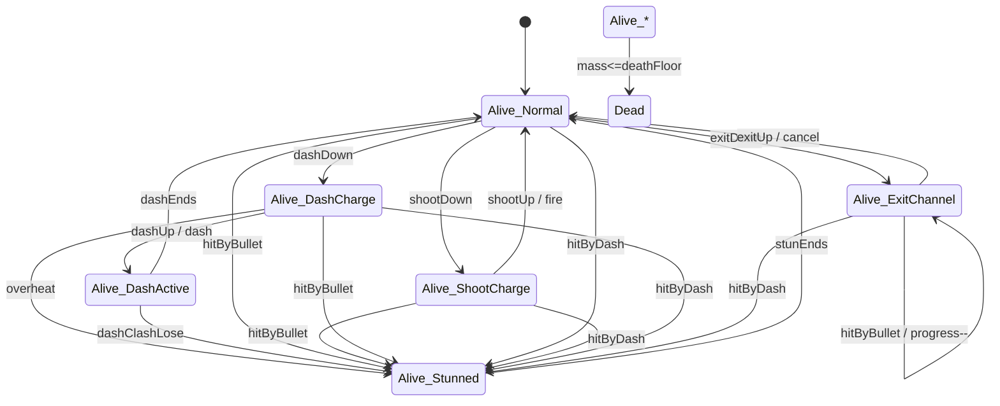
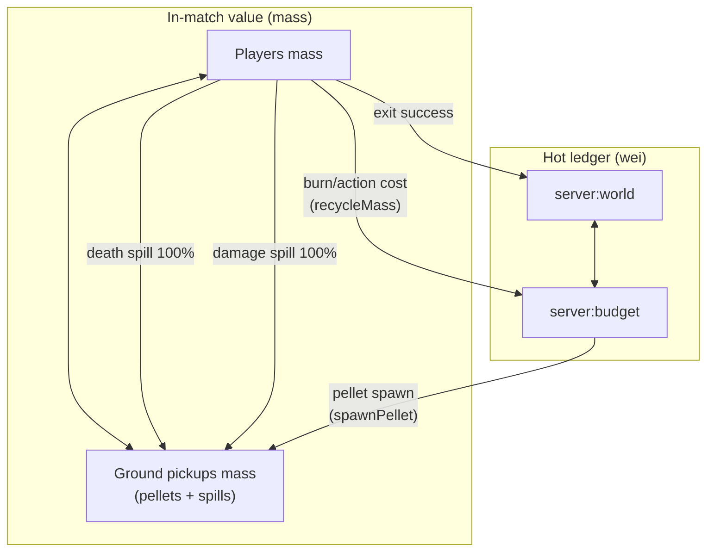
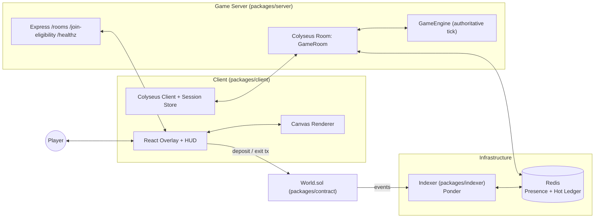
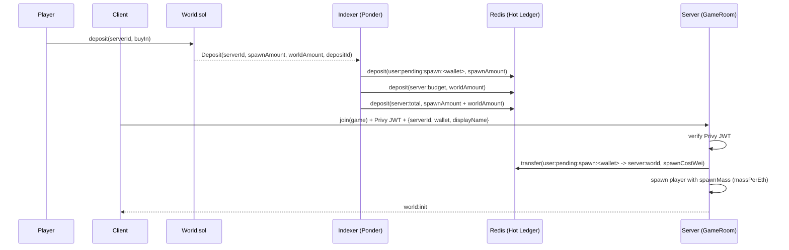
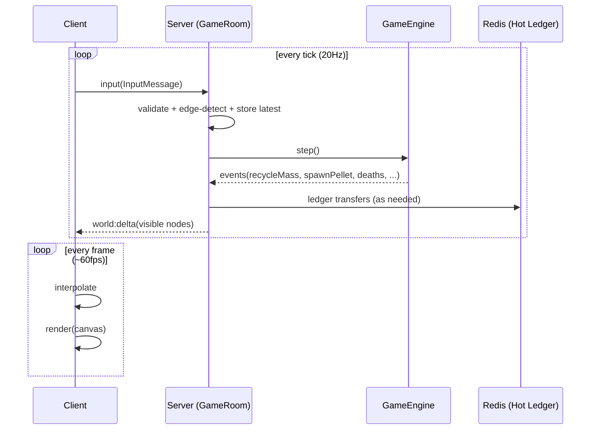
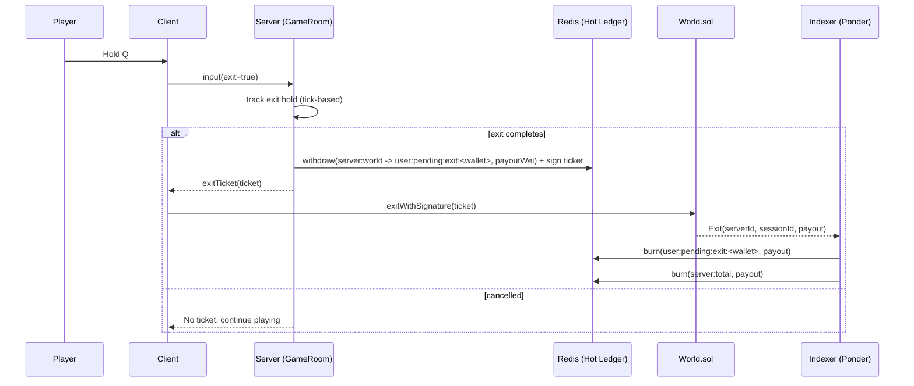

# Game Architecture — Production Spec (Canonical)

This is the **single canonical end-state document** for the game: it includes both the **game design spec** and the **production architecture** that implements it in this monorepo.

It defines:
- the runtime components and their responsibilities
- server/client module boundaries
- authoritative tick pipeline
- message contracts (`input`, `world:init`, `world:delta`, `exitTicket`)
- economy + hot-ledger invariants (Redis-backed accounts)
- scalability and security requirements

---

## 0) Game design

### 0.1 Core loop (player POV)

- **Deposit to spawn**: player deposits to a specific `serverId` (on-chain). The server verifies eligibility and spawns the player with a deterministic starting `mass`.
- **Fight + collect to grow**: in-world, **mass is both money and survivability** (mass controls size + the exit payout).
- **Hold-to-exit to cash out**: player holds **Q** to start an exit channel. If they survive the full hold window, the server produces a **signed exit ticket**. The player claims on-chain.

Design goal: the optimal strategy is not “always fight” and not “always farm”; profit requires **risk-managed interaction** and good exit timing.

### 0.2 Controls and input semantics

Top-down tactical arena:

- **Move**: WASD (thrust intent)
- **Aim**: mouse (world-space aim point)
- **Shoot**: hold LMB to charge; release to fire
- **Dash**: hold RMB (or Space) to charge; release to dash; holding too long can overheat/stun
- **Exit**: hold Q to channel exit

How this maps to the network protocol:

- Client sends `InputMessage` every tick / throttled:
  - movement holds (`w,a,s,d`)
  - aim point (`aimX, aimY`)
  - action holds (`shoot, dash, exit`)
- The **server performs edge detection** to derive “press/release” events and charge progression (no client timing trust).

### 0.3 Player state machine (authoritative)

The design must be expressible as a small explicit state machine to avoid ambiguous edge cases.



**State notes:**

- **Alive_DashActive**: player is **invincible to damage** (bullets pass through; no mass loss; no bullet hitstun). Collisions still resolve physically (you don’t phase through walls/obstacles), but they do not deal damage. **Dash impacts still stun targets** based on dash momentum; **exception**: on **dash-vs-dash collision**, stun is determined by **momentum difference** (see Dash rules).
- **Alive_ExitChannel**: taking damage does **not** stun or jam the exit — it still **reduces mass normally** and also **decreases exit progress proportional to damage**. All actions are disabled during exit, so this cannot be used as a shield.
- **Alive_Stunned**: brief hitstun; player cannot act. Caused by bullet hits (from Normal/ShootCharge/DashCharge) or dash overheat.

**Priority rule** (recommended): `Stunned > ExitChannel > DashCharge > DashActive > ShootCharge > Normal`.

### 0.4 Combat rules (design-level)

**Mass = HP = payout base** (within a server/shard):

- Being hit reduces your `mass`.
- **On hit (non-lethal)**: **100%** of damage mass is converted into **spills** at/near the victim (no portion goes to budget).
- **On death**: **100%** of remaining mass is converted into **spills** (no remainder burned).
- **On action cost** (dash / shoot / abilities): mass is removed from the actor and **recycled to the world budget** (future pellets).

#### Bullets (shooting)

- Shot is **charge-based**:
  - charge affects bullet damage, bullet radius, bullet speed, and the action cost.
  - charge duration is computed server-side from ticks between shootDown and shootUp.
- **Action cost**: firing consumes mass that is recycled to budget; it scales with **current mass** and **charge**:
  - `costMass = mass * shootCostRate(chargeNorm, mass)` (design knob)
- **Defaults (PoC parity)**:
  - `shootMinCostPct = 0.5%`, `shootMaxCostPct = 2.5%` of **current mass** (charge-scaled)
  - `bulletDamageMinPct = 10%`, `bulletDamageMaxPct = 25%` of **spawnMass** (charge-scaled)
  - `shootChargeTimeMs = 1200`
- Bullets:
  - collide with obstacles and despawn
  - collide with players and apply damage (damage mass becomes **spills**, 100%)
  - apply **hitstun** that scales with damage (unless target is in **Alive_DashActive** or **Alive_ExitChannel**):
    - `stunTicks = clamp(stunMin + damageMass * stunPerMass, stunMax)`
  - have finite lifetime (ttl ticks)
  - may inherit a portion of shooter velocity (design knob)

#### Dash

- Dash has a **charge → release** pattern:
  - charging is visible and commitful
  - overcharging can cause a stun/overheat window
  - release applies a burst impulse and (optionally) brief projectile immunity
- **Action cost**: dashing consumes mass that is recycled to budget; it scales with **current mass** and **charge**:
  - `costMass = mass * dashCostRate(chargeNorm, mass)` (design knob)
- **Defaults (PoC parity)**:
  - `dashMinCostPct = 1%`, `dashMaxCostPct = 5%` of **current mass** (charge-scaled)
  - `dashBaseForce = 8`, `dashMaxForce = 20` (world units)
- Dash impacts can create:
  - **stun** outcomes (commitment-based hard counter)
  - bounces/slides on obstacles

**Dash impact + clash rules (authoritative):**

- **Dash momentum** at impact:
  - `momentum = mass * speed` (speed = magnitude of velocity at impact)
- **Dash vs non-dash**:
  - any player hit by an active dash is **stunned**
  - stun scales with dash momentum:
    - `stunTicks = clamp(stunMin + momentum * stunPerMomentum, stunMax)`
- **Dash vs dash**:
  - determine `momentumDelta = abs(momentumA - momentumB)`
  - the player with **lower momentum** receives the primary stun (`dashClashLose`)
  - stun scales with momentum difference:
    - `stunTicks = clamp(stunMin + momentumDelta * stunPerMomentumDelta, stunMax)`

#### Wealth → power curve (defaults, PoC parity)

- **Size curve (compress extremes)**:
  - `massNorm = mass / spawnMass`
  - `radius = clamp((massNorm ^ radiusExponent) * radiusAtSpawn, radiusMin, radiusMax)`
  - defaults: `radiusExponent = 0.40`, `radiusAtSpawn = 48`, `radiusMin = 22`, `radiusMax = 110`
- **Mobility curve (bounded)**:
  - `mobilityMult = clamp((radiusRef / radius) ^ mobilityExponent, mobilityMin, mobilityMax)`
  - defaults: `radiusRef = 36`, `mobilityExponent = 0.6`, `mobilityMin = 0.85`, `mobilityMax = 1.15`
- **Acceptance target**: small gets ~10–30% mobility edge; large remains a threat (not a giant practice target).

#### Pickups: pellets + spills

- **Pellets**: budget-funded passive value; intended to be supplemental.
- **Spills**: created by combat (from damage or death) and should be **contested**.
- **Victim lock + attacker advantage**:
  - **Single timing knob**: `unlockTick` controls both victim lock and attacker advantage.
  - while `tick < unlockTick`:
    - **victim cannot collect**
    - **attacker has magnetic advantage** on these spills (boosted magnet strength/range)
    - **everyone else can collect** (no restriction)
  - when `tick >= unlockTick`:
    - victim can collect
    - attacker advantage ends
  - **PoC defaults we should keep** (20 TPS):
    - set `unlockTick = spawnTick + 30` (1500ms) — PoC uses `TIMER_TICKS.lootOwnership = 30`
    - base magnet: `magnetStrength = 0.5`, `magnetRange = 30` — PoC `CONFIG.magnetStrength`, `CONFIG.magnetRange`
    - attacker advantage: `magnetBoostMult = 2.5`, `magnetBoostRange = 80` — PoC `CONFIG.magnetBoostMult`, `CONFIG.magnetBoostRange`
- **Spill representation**:
  - **performance-safe default**: consolidated drops (PoC parity) — 1–3 pickups per spill event:
    - `<= 0.25 * spawnMass` → 1 drop
    - `<= 0.75 * spawnMass` → 2 drops
    - `> 0.75 * spawnMass` → 3 drops
  - optional "juicy" chunking must still be hard-capped:
    - `spillMaxPickupsPerEvent` and `spillMaxPickupsPerTick`
  - distribute remainder deterministically so mass is conserved
- **Magnetism**:
  - pickups can have mild magnet behavior to reduce pixel-perfect farming; can be boosted briefly for attackers to reward commitment.
- **Spill pickup delay**:
  - `spillPickupDelayTicks = 4` to prevent instant same-tick collection.

### 0.5 Economy design + conservation (design-level)

The economy must be **money-conserving** and **auditable**.

Where value lives:

- **Players**: mass held by living entities
- **Pickups**: mass on the ground (pellets/spills)
- **Hot-ledger accounts**:
  - `server:world` (in-match backing for all claimable mass)
  - `server:budget` (pellet emission budget)

Value flow (conceptual):



#### Passive tax to budget (PoC parity default)

- per second, remove mass from each player and recycle to `server:budget`:
  - `baseTaxMass = spawnMass * 3 / 2000` (0.15% of spawnMass per second)
  - `wealthTaxMass = max(0, mass - spawnMass) * 0.01` (1% of profit per second)
- applied per tick with integer rounding (floor)

#### Budget depletion behavior

- pellet spawns pause if `server:budget` is below `pelletSpawnMinWei` (no minting).
- engine continues; emit `budget_exhausted` telemetry for tuning.
- bootstrap reserve is allowed only via an explicit ledger transfer (no free mint).

#### Pellet emission valve (PoC parity)

- keep pellets **supplemental** by capping total pellet value in world (`maxPelletValueInWorld`) and checking spawns on a fixed interval (~1s).
- target passive pellet value ≈ 20% of spawnMass over a full session (tuneable).

Important: the *engine* operates in mass and emits events; the *room* performs the wei transfers that back those mass events (see §8).

### 0.6 Exit design (hold-to-exit)

- **Exit input**: hold Q (`exit=true`) to channel.
- **Commitment**:
  - while channeling, **movement + shoot + dash are disabled** (exit cannot be used as a defensive “shield”).
- **Contestability**:
  - taking damage **still reduces mass normally** and also **reduces exit progress proportional to damage**.
  - exit progress rate **ramps up** the longer Q is held (with a cap).
- **Exit duration (default)**: `exitDurationTicks = 60` (3s @ 20 TPS) for a full channel with no damage.
- **Exit beacon (contestability)**: while exiting, player emits a beacon; range scales with size:
  - `exitBeaconRange = exitBeaconBaseRange + radius * exitBeaconRangePerRadius` (defaults: 450 + 7 * radius)
- **Anti-grief boost**: if no enemies within `exitBeaconRange` for `exitSafeHoldTicks` (default 20), apply `exitSafeRateMult` (default 1.25) to progress gain.
- **Success**:
  - on completion, server computes payout from authoritative mass and produces a signed exit ticket.

#### Exit progress mechanics (authoritative)

Server-side, per player:

- **State**:
  - `exitHoldTicks`: consecutive ticks with `exit=true`
  - `exitProgress`: normalized progress in \([0,1]\)
- **Progress gain** (each tick while `exit=true`):
  - `exitHoldTicks += 1`
  - `rate = clamp(rateMin + rateRamp * exitHoldTicks, rateMax)`
  - if no enemies within `exitBeaconRange` for `exitSafeHoldTicks`, `rate *= exitSafeRateMult`
  - `exitProgress += rate`
- **Progress loss on damage** (on each hit event with `damageMass`):
  - `mass -= damageMass` (normal damage)
  - `exitProgress -= damageMass * progressLossPerMass`
  - clamp `exitProgress` to \([0,1]\)
- **Cancel** (on `exit=false`):
  - `exitHoldTicks = 0` and `exitProgress = 0` (full reset)
- **Complete**:
  - when `exitProgress >= 1`, exit succeeds and the room generates an exit ticket from the current authoritative mass.

### 0.7 World design + scaling (100 CCU target)

Should support **~100 CCU** with stable encounter density. Two compatible approaches:

- **Static bounds** (rect): simplest; rely on spawn rules and interest management.
- **Dynamic border** (circle): border radius scales with players-in-world to keep “players in view” roughly constant.

Regardless of approach, the server must implement:

- **spawn safety** (avoid spawning into immediate death)
- **interest management** (send only nearby relevant nodes)
- **spatial hashing** for collisions and relevance queries

---

## 1) Big picture (runtime blocks)

The game runs as an **off-chain authoritative simulation** (server) with on-chain deposit/exit settlement and an indexer that mirrors on-chain events into Redis “hot ledger” accounts.



### Non-negotiable properties

- **Server-authoritative** outcomes: no client trust for movement, damage, pickups, or exit success.
- **Fixed tick simulation** (20Hz recommended): deterministic system ordering; stable fairness.
- **Interest-managed replication**: each client receives only relevant nodes via deltas.
- **Economy is auditable**: pellet spawning, recycling, and exits must reconcile to the hot ledger.

---

## 2) Core concepts + units

### 2.1 Canonical value unit: `mass`

Production gameplay uses **mass** as the canonical in-match value unit.

- **Numeric representation**: `mass` uses fixed-point integer units (`MASS_SCALE = 1e4` by default). Display mass = `mass / MASS_SCALE`.
- **Conversion rounding**: mass↔wei conversions always round down; any dust remains in `server:world` backing and is not represented in mass.
- **Canonical conversions** (integer math):
  - `mass = floor((wei * massPerEth * MASS_SCALE) / 1e18)`
  - `wei = floor((mass * 1e18) / (massPerEth * MASS_SCALE))`
- `massPerEth` (indexed from `World.sol`) defines display-mass per ETH; conversions use the fixed-point formulas above.
- USD display is client-only using an ETH/USD price feed.

Client reference implementation:
- `packages/client/src/lib/formatter.ts`: `massToEth()` and `massToUsd()`

Server reference conversion utilities:
- `packages/server/src/services/exitController.ts`: `massToPayoutAmount()` and `payoutAmountToMass()`

### 2.2 Ledger unit: `wei` (hot ledger)

Redis “hot ledger” accounts store balances in **wei** (bigint in code, string in Redis).

The indexer credits/burns accounts on-chain events (idempotently), and the server moves balances between accounts during gameplay.

---

## 3) Monorepo architecture (what lives where)

### 3.1 Server module layout (authoritative)

This replaces the current structure in `packages/server/src/rooms/`.

Recommended layout:

```
packages/server/src/rooms/
  GameRoom.ts                         # Colyseus Room lifecycle + wiring
  protocol.ts                         # protocolVersion + message payload types
  dto.ts                              # node DTOs for world:delta
  sim/
    config.ts                         # tickMs + gameplay constants
    rng.ts                            # seeded RNG helpers
    state.ts                          # authoritative state types
    events.ts                         # engine->room events (ledger + telemetry)
    engine.ts                         # GameEngine.step()
    spatial/
      grid.ts                         # spatial hash (collision + interest)
    systems/
      input.ts
      movement.ts
      dash.ts
      shooting.ts
      bullets.ts
      collisions.ts
      economy.ts
      spawns.ts
      cleanup.ts
```

**Rule**: `GameEngine` must be pure simulation (mass + ticks + RNG). It should not talk to Redis, Ponder, Privy, or Colyseus directly.

### 3.2 Client module layout (render + input)

Keep the existing structure (World.tsx + adapter + renderer + input listeners), but replace implementations:

```
packages/client/src/world/
  World.tsx                           # canvas host
  snapshot.ts                         # snapshot readiness guards
  adapters.ts                         # delta snapshot -> GameViewModel
  renderer.ts                         # canvas renderer
  input.ts                            # input listeners/controller
```

**Rule**: renderers remain framework-agnostic (no React imports).

### 3.3 Client feel (cosmetic only)

- Client plays immediate charge/aim/exit VFX and HUD timers on input.
- Server remains authoritative for outcomes; client never spawns bullets/dash/exit success locally.
- Client aligns charge bars and cooldown UI to server tick timestamps.

---

## 4) Server architecture (GameRoom)

`GameRoom` is the integration boundary between:
- auth/session lifecycle (Privy)
- economic plumbing (hot ledger + exit tickets)
- authoritative simulation (`GameEngine`)
- replication (interest + deltas)

### 4.1 Responsibilities

- **Auth**: verify Privy JWT in `static onAuth(token)`.
- **Join**:
  - reconnect path if a living entity exists for wallet
  - spawn path consumes hot-ledger spawn credit:
    - `ledger.transfer(serverId, user:pending:spawn:<wallet> -> server:world, spawnCostWei)`
  - spawn player into engine with `spawnMass = payoutAmountToMass(spawnCostWei, massPerEth)`
  - send `world:init` to the joining client
- **Input**: receive `"input"` messages; validate + edge-detect + store latest per client; if no input for `inputStaleTicks` (default 4), clear holds and cancel charge/exit.
- **Tick loop**: `setSimulationInterval(update, tickMs)`; call `engine.step()` once per tick.
- **Ledger coupling**: translate engine events (aggregated per tick) into ledger transfers; one transfer per kind per tick (idempotent).
- **Exit ticket**:
  - on successful exit, compute payout from authoritative mass and call:
    - `ledger.withdraw(serverId, wallet, payoutWei, sessionId, signingConfig, idempotencyKey)`
    - `idempotencyKey = ${sessionId}:${exitAttemptId}` (monotonic per player)
  - send `exitTicket` message to client (existing client flow expects this).
- **Interest-managed deltas**: send `world:delta` with visible nodes per client each tick.
- **Room metadata**: publish balances and config in room metadata for `/rooms`.

### 4.2 Not responsibilities

- GameRoom does *not* implement combat rules; it orchestrates the engine.
- GameRoom does *not* do client prediction.

### 4.3 Disconnect / reconnect semantics (authoritative)

- On disconnect: immediately clear held inputs; cancel dash/shoot charge and exit channel. Player remains in world but inert.
- Reconnect grace: keep entity for `reconnectGraceTicks = 200` (10s @ 20 TPS). If reconnects, rebind and send `world:init` + a full delta.
- After grace: treat as death (spill 100% mass) and remove entity; no exit ticket.
- If disconnect happens mid-dash, invincibility ends after the current tick; no free safety.

---

## 5) Simulation architecture (GameEngine)

### 5.1 Authoritative entities

GameEngine state should include (at minimum):

- **Player**
  - identity: `sessionId`, `wallet`, `displayName`
  - kinematics: `x,y,vx,vy`
  - value: `mass` (authoritative)
  - timers/state: dash charge/cooldown, stun/iframes, shoot charge/cooldown, exit state/progress, etc.

- **Bullet**
  - `x,y,vx,vy,radius,damageMass,ownerSessionId,ttlTicks`

- **Pickup**
  - pellets (budget-funded): `x,y,mass,radius`
  - spills (damage-funded): `x,y,mass,radius,attackerSessionId,victimSessionId,unlockTick`
    - victim cannot collect until `unlockTick` (others can)
    - attacker gets magnet advantage for these spills until `unlockTick` (PoC-style boost: `magnetBoostMult`, `magnetBoostRange`)

- **Obstacle**
  - collision shape (start with circles; polygons optional)

- **World**
  - bounds (rect or circle), tick counter, seeded RNG state
  - economy accumulators (spawn carry, burn buckets, etc.)

### 5.2 Determinism rules (mandatory)

- **No wall clock** for gameplay logic (`Date.now()` only allowed in Room-level integration if absolutely necessary).
- **No unseeded randomness**: all randomness must go through `rng.ts` seeded at room creation.
- **No order-dependent iteration over unstable structures**: if iterating Maps/Sets, define stable ordering where it matters.
- **Fixed-point + rounding**: all value-changing math (mass, costs, damage, stun, momentum) uses integer/fixed-point with explicit rounding; clamp after rounding.
- **Deterministic hit ordering**: accumulate collision events, sort by `(targetId, sourceId, kind)` before resolution.

### 5.3 Tick pipeline (canonical order)

The authoritative tick must run these steps in order:

1. **Input ingest** (edge detection, build per-player intents)
2. **World/border update** (if dynamic)
3. **Movement physics** (WASD thrust + drag)
4. **Dash** (charge, overheat, release, stun outcomes)
5. **Shooting** (charge/release -> spawn bullets)
6. **Bullets** (integrate, ttl)
7. **Collisions** (bullets, bodies, pickups, obstacles; swept tests)
8. **Hit resolution** (apply damage, stun, exit progress loss)
9. **Economy** (burn/tax, action costs, reserve emission)
10. **Spawns** (pellets, spills; bots optional)
11. **Cleanup** (remove dead/expired)
12. **Emit engine events** (ledger + telemetry)

### 5.4 Hit resolution rules (deterministic + fair)

- Collect all hit candidates during collisions; do not mutate mass mid-iteration.
- Resolve in priority order:
  1) dash vs dash
  2) dash vs player
  3) bullet hits
- For each target, aggregate `totalDamageMass` and `maxStunTicks`; apply once per tick.
- Dash vs dash tie rule: if `momentumA == momentumB` after rounding, both receive `stunMin` and bounce.
- Exit completion check happens **after** hit resolution; if stunned this tick, exit fails and progress resets.
- Post-stun grace: apply `stunGraceTicks` (default 6–10) where damage applies but stun cannot be re-applied.

### 5.5 High-speed collision handling (no tunneling)

- Bullets and dash movement use **swept circle tests** against players/obstacles.
- If sweep is too expensive, cap max speed so `speedPerTick <= cellSize / 2`, or sub-step fast movers.

---

## 6) Replication architecture (interest + deltas)

Reuse the current best-parity replication model:

- `world:init` (static config) once per join/rejoin
- `world:delta` each tick, containing only nodes relevant to that client

### 6.1 Interest definition

Interest region should be based on:

- player position
- view radius/zoom (often derived from size)
- **threat margin**: bullets must become relevant before they hit

Recommended approach:
- a uniform grid/spatial hash used both for collision queries and for interest queries.

### 6.2 Load shedding + LOD (mandatory at 100 CCU)

- Hard cap per client per tick: `maxNodesPerDelta` (prioritize players, bullets, large spills, then pellets).
- Pickups below `minPickupMassForDelta` are omitted outside `pickupInterestRadius`.
- Optional spill clustering for far range: aggregate spills inside a grid cell into a `spillCluster` node (non-collectable, VFX only).
- When caps are hit, selection is deterministic (priority, then `id`).

---

## 7) Protocol (message contracts)

### 7.1 `world:init` (server -> client)

Sent after join (and on reconnect).

```ts
export type WorldInitDto = {
  protocolVersion: number
  serverId: string
  tickMs: number
  world: { left: number; right: number; top: number; bottom: number }
  massPerEth: number
  exitHoldMs: number
}
```

### 7.2 `world:delta` (server -> client)

Sent every tick. The client stores nodes in a Map and interpolates.

```ts
export type WorldDeltaDto = {
  tick: number
  nodes: NodeDto[]
  removedIds: number[]
  ownedIds: number[]
}
```

### 7.3 `input` (client -> server)

Explicit: movement, aim, held actions.

```ts
export type InputMessage = {
  // Movement intent
  w: boolean
  a: boolean
  s: boolean
  d: boolean

  // Aim target in world space
  aimX: number
  aimY: number

  // Holds
  shoot: boolean // LMB
  dash: boolean  // RMB or Space
  exit: boolean  // Q

  // Optional: future reconciliation
  clientTick?: number
}
```

**Edge detection is server-side** (derive press/release and one-tick triggers).

### 7.4 `exitTicket` (server -> client)

The current client already expects this message.

Payload should remain compatible with `@goonverse/accounts` serialized ticket:

```ts
export type SerializedExitTicket = {
  serverId: string
  sessionId: string
  player: string
  payout: string
  deadline: string
  signature: string
}
```

### 7.5 Node DTOs

DTOs are renderer-oriented (not full authoritative state mirrors).

```ts
export type NodeDto =
  | {
      kind: "player"
      id: number
      ownerSessionId: string
      displayName: string
      x: number
      y: number
      radius: number
      mass: number
      color: { r: number; g: number; b: number }
      flags: number
    }
  | { kind: "bullet"; id: number; x: number; y: number; radius: number; flags: number }
  | { kind: "pellet"; id: number; x: number; y: number; radius: number; mass: number; flags: number }
  | {
      kind: "spill"
      id: number
      x: number
      y: number
      radius: number
      mass: number
      attackerSessionId?: string
      victimSessionId?: string
      unlockTick?: number
      flags: number
    }
  | { kind: "spillCluster"; id: number; x: number; y: number; radius: number; mass: number; count: number; flags: number }
  | { kind: "obstacle"; id: number; x: number; y: number; radius: number; shape?: number; rot?: number; flags: number }
```

**LOD note**: `spillCluster` is non-collectable and used only for far-range rendering; clients must not treat it as loot. Enabling it is a protocol change (bump `protocolVersion`).

**Protocol versioning**

- `protocolVersion` in `world:init` must be bumped on breaking changes to `input` or DTOs.
- Clients should refuse to render if `protocolVersion` is unknown.

---

## 8) Economy + hot ledger (authoritative invariants)

Must preserve the production economic plumbing used today.

### 8.1 Hot-ledger accounts (Redis)

Credited/burned by the indexer (`packages/indexer/src/World.ts`):

- On Deposit:
  - `user:pending:spawn:<wallet>` += `spawnAmount`
  - `server:budget` += `worldAmount`
  - `server:total` += `spawnAmount + worldAmount`

- On Exit (on-chain claim):
  - `user:pending:exit:<wallet>` -= `payout`
  - `server:total` -= `payout`

Moved by the game server during gameplay:

- Spawn:
  - `user:pending:spawn:<wallet> -> server:world` (spawnCostWei)
- Pellet spawn:
  - `server:budget -> server:world` (costWei)
- Recycling (burn/action costs):
  - `server:world -> server:budget` (recycledWei)
- Exit ticket generation:
  - `ledger.withdraw(serverId, wallet, payoutWei, sessionId, signingConfig, idempotencyKey)`
    - moves `server:world -> user:pending:exit:<wallet>` and returns a signed ticket

### 8.2 Engine ↔ Room coupling (recommended)

Keep the engine pure and emit events like:

- `recycleMass(mass)` -> Room transfers `server:world -> server:budget`
- `spawnPellet(mass)` -> Room transfers `server:budget -> server:world` before confirming spawn
- `playerExited(sessionId)` -> Room withdraws and emits `exitTicket`
- Engine should emit **per-tick aggregates** (e.g., `recycleMassTotal`, `pelletSpawnMassTotal`, `pelletSpawnCount`) so Room performs one ledger transfer per kind per tick.
- Ledger transfers are idempotent with keys like `roomId:tick:kind`; **never** do per-pickup ledger ops.

### 8.3 Conservation acceptance tests

These must hold in production:

- **No pellet minting**: pellets only spawn after a successful `server:budget -> server:world` transfer.
- **No silent sinks**: if the engine reduces player mass via burn/action costs, it must emit `recycleMass` so funds recycle back to budget.
- **No negative budget**: if `server:budget` is empty, pellet spawn must stop (engine continues).
- **Exit tickets only via ledger.withdraw**: ensures replay safety and server solvency gating.
- **Rounding dust accounted**: conservation checks allow only explicit rounding dust tracked in `server:world`.

---

## 9) Key flows (sequence diagrams)

### 9.1 Deposit -> join -> spawn



### 9.2 Tick loop: input -> sim -> ledger -> deltas -> render



### 9.3 Exit hold -> ticket -> on-chain claim



---

## 10) Scaling + performance requirements (100 CCU target)

- **Interest management**: replication must scale with view box, not world size.
- **Spatial hash**: required for collision and replication queries; avoid O(n²).
- **Bounded work per tick**:
  - bullets query only nearby buckets
  - pickups query only nearby buckets
  - avoid scanning all entities for each entity

---

## 11) Security + anti-cheat requirements

- Server enforces physics and collisions; client only sends input intent.
- Input validation:
  - clamp booleans; clamp aim to world bounds; rate-limit or coalesce spam
- Economy safety:
  - only `ledger.withdraw()` can mint an exit ticket
  - World.sol replay protection prevents duplicate claims

---

## 12) Observability (must-have)

GameRoom should produce:
- tick duration and per-system timings
- visible node counts per client (avg/max)
- ledger transfer failures (budget exhausted, etc.)
- exit attempts vs success rates
- input stale resets / disconnect grace expiries
- LOD drops (nodes omitted due to caps) + spill cluster counts

Dev-only:
- conservation assertions every N ticks with actionable diagnostics
